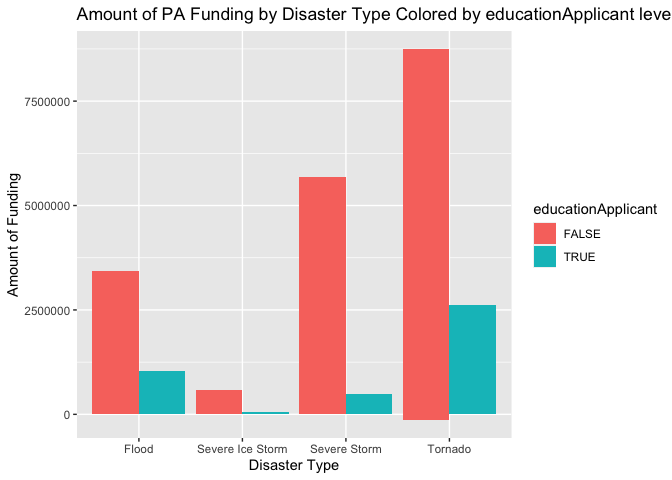
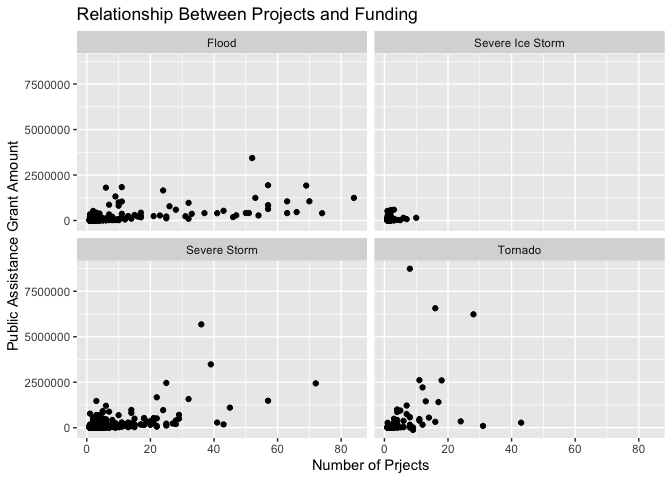
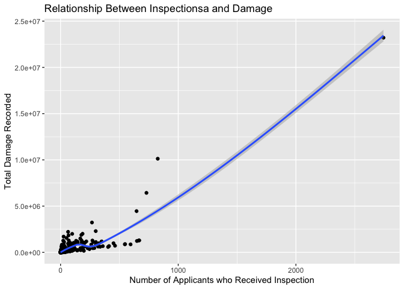
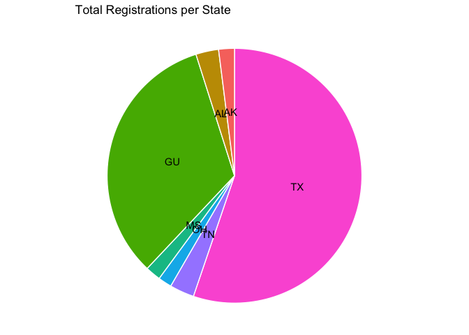
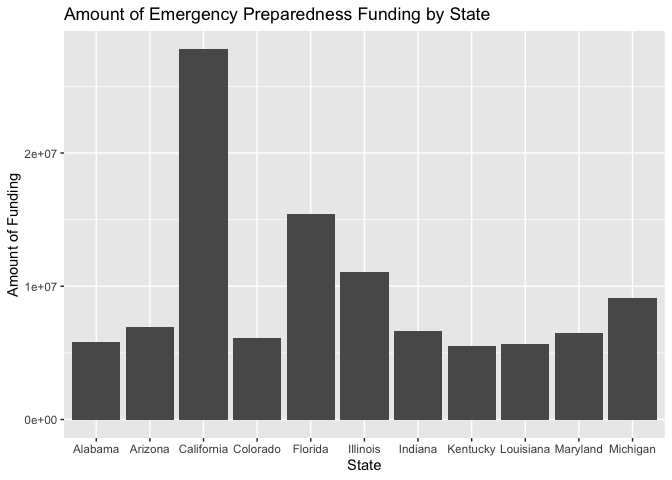
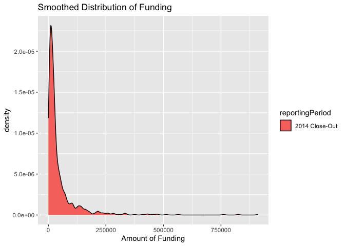

Project 2: Creating a Vignette for API Interactions
================
Angelice Floyd
2023-10-11

- [Introduction and Requirements](#introduction-and-requirements)
  - [Introduction](#introduction)
  - [Requirements](#requirements)
- [Functions for API Interactions](#functions-for-api-interactions)
  - [Public Assistance Funded Projects
    Endpoint](#public-assistance-funded-projects-endpoint)
  - [Individual Assistance for
    Homeowners](#individual-assistance-for-homeowners)
  - [Emergency Management Performance
    Grant](#emergency-management-performance-grant)
- [Data Exploration](#data-exploration)
  - [Public Assistance Funded
    Projects](#public-assistance-funded-projects)
    - [Data pulls](#data-pulls)
    - [Contingency Tables](#contingency-tables)
    - [Numerical Summaries](#numerical-summaries)
    - [Plots](#plots)
  - [Individual Assistance for
    Homeowners](#individual-assistance-for-homeowners-1)
    - [Numerical Summaries](#numerical-summaries-1)
    - [Plots](#plots-1)
  - [Emergency Management Performance
    Grants](#emergency-management-performance-grants)
    - [Numerical Summaries](#numerical-summaries-2)
    - [Plots](#plots-2)
- [Wrap Up](#wrap-up)

# Introduction and Requirements

## Introduction

This project creates a vignette for reading and summarizing data from a
FEMA ( Federal Emergency Management Agency) API. The first section will
consist of pulling in all of the necessary libraries needed to run the R
program, contact the API from the FEMA webiste, and create the
exploratory data analysis from the data. The second section will create
the functions for interacting with the API. The Third section will use
the data from the API function interaction for some exploratory data
analysis. Finally, there will be a wrap up to summarize what was done in
the vignette.

## Requirements

This section loads the packages required for interacting with the FEMA
API, manipulating the data, and conducting exploratory data analysis.

``` r
library(tidyverse)
library(httr)
library(jsonlite)
library(knitr)
```

# Functions for API Interactions

## [Public Assistance Funded Projects Endpoint](https://www.fema.gov/openfema-data-page/public-assistance-funded-project-summaries-v1)

The first function created interacts with the Public Assistance endpoint
of the FEMA API. This data contiains numerical and categorical summary
information on funding projects that FEMA conducted geared towards
public assistance. For consistency and use in later analysis, the two
state abbreviation was created. This function is designed to filter the
data by full state name. Thus, if a string that is not a valid state
name ( or the name is not available) is entered, an error message will
appear prompting you to enter a valid or available state name. One thing
that I found interesting about this data was that a large amount of
participants were southern states. Thus, some of the main states in the
dataset were Texas, Alabama, and Tennessee\> there are some states like
Colorado and North Dakota, but the majority are southern states.

``` r
PAdata <- function(statename = "all") {
  #pull the public assistance summaries from the Public assistance endpoint
  
  outputAPI <- fromJSON(
    "https://www.fema.gov/api/open/v1/PublicAssistanceFundedProjectsSummaries" 
    )
  
   APIData <- outputAPI$PublicAssistanceFundedProjectsSummaries %>% 
     mutate(stateabb = state.abb[match(state,state.name)])
 
   #If the default state name of 'all' is not included, then make sure that the 
   #chosen name is included, and filter, otherwise, print out an error
   if(statename != "all"){
     if(statename %in% APIData$state) {
       output <- APIData %>% filter(state == statename)
     }
     else{
       message <- print("Please try again and enter a valid state name")
       stop(message)
     }
   }
   else{ 
     output <- APIData
   }
  return(output)
}

data <- PAdata()
knitr::kable(head(data,50))
```

| disasterNumber | declarationDate          | incidentType | state | county    | applicantName                                     | educationApplicant | numberOfProjects | federalObligatedAmount | lastRefresh              | hash                                     | id                                   | stateabb |
|---------------:|:-------------------------|:-------------|:------|:----------|:--------------------------------------------------|:-------------------|-----------------:|-----------------------:|:-------------------------|:-----------------------------------------|:-------------------------------------|:---------|
|           1239 | 1998-08-26T00:00:00.000Z | Severe Storm | Texas | Edwards   | EDWARDS (COUNTY)                                  | FALSE              |               20 |              352427.09 | 2023-03-18T17:02:48.443Z | a18872962143d707fb83e3f0b054abda40413d04 | 0646e381-ea0a-46e5-993d-1bdb1cfe2a27 | TX       |
|           1239 | 1998-08-26T00:00:00.000Z | Severe Storm | Texas | Kimble    | JUNCTION, CITY OF                                 | FALSE              |                1 |                6234.90 | 2023-03-18T17:02:48.443Z | d1c77a224203725a79d26a1d84f8ad2b06b36c7f | bc05fe25-0f1e-4344-a120-55f23f45cd4e | TX       |
|           1239 | 1998-08-26T00:00:00.000Z | Severe Storm | Texas | Kimble    | KIMBLE (COUNTY)                                   | FALSE              |                5 |               69933.35 | 2023-03-18T17:02:48.443Z | 7fb2d6dd706512236b3ed6c0e6ddd6a633b50d38 | d9c845c8-5db4-404b-866d-e06b3c73397a | TX       |
|           1239 | 1998-08-26T00:00:00.000Z | Severe Storm | Texas | Kimble    | TEXAS TECH UNIVERSITY CTR                         | TRUE               |                1 |                2850.00 | 2023-03-18T17:02:48.443Z | 571fab79609fe373f64529b540289ee5dd400ed5 | 9350e760-64da-4931-ace0-0e37d7e82eb3 | TX       |
|           1239 | 1998-08-26T00:00:00.000Z | Severe Storm | Texas | Kinney    | FORT CLARK MUNICIPAL UTILITY                      | FALSE              |                1 |                5016.00 | 2023-03-18T17:02:48.443Z | 39207f1c57e1f088bef0ce07238c1aa9a18022d8 | a196ef51-9883-47c8-809d-1d797e8e1f48 | TX       |
|           1239 | 1998-08-26T00:00:00.000Z | Severe Storm | Texas | Kinney    | KINNEY (COUNTY)                                   | FALSE              |                8 |              248569.77 | 2023-03-18T17:02:48.443Z | c40a42519f16f555bf7a5dcf0b80e9b9822c4a20 | 39de6538-b22a-4f4d-9bc5-e8331fae5754 | TX       |
|           1239 | 1998-08-26T00:00:00.000Z | Severe Storm | Texas | Kinney    | SPOFFORD                                          | FALSE              |                1 |                3842.44 | 2023-03-18T17:02:48.443Z | 27a47496ec86dfe6040e1e990fe2a7e629004e1d | a7b65c71-04ad-42cb-bf3b-5a9171b890d1 | TX       |
|           1239 | 1998-08-26T00:00:00.000Z | Severe Storm | Texas | Maverick  | EAGLE PASS                                        | FALSE              |               11 |              260653.76 | 2023-03-18T17:02:48.443Z | eb5abec160a33b3d2bf0a6f9eaa08295e9a698a9 | 1ce2637e-8b52-4c80-b393-72a2b498cd51 | TX       |
|           1239 | 1998-08-26T00:00:00.000Z | Severe Storm | Texas | Maverick  | EAGLE PASS INDEPENDENT SCHOOL                     | TRUE               |                1 |                4658.78 | 2023-03-18T17:02:48.443Z | f57284709347d5bb5e37c1c209c7a091eabb4c8c | bab5ed18-737b-4604-a286-1c572219c6db | TX       |
|           1239 | 1998-08-26T00:00:00.000Z | Severe Storm | Texas | Maverick  | MAVERICK (COUNTY)                                 | FALSE              |                2 |                8837.25 | 2023-03-18T17:02:48.443Z | 8d5736e71037dc2399842f82a355a85d07ee1e91 | 53ca6416-0b75-4c84-9eed-af4c59460502 | TX       |
|           1239 | 1998-08-26T00:00:00.000Z | Severe Storm | Texas | Real      | CAMP WOOD                                         | FALSE              |                5 |               12302.48 | 2023-03-18T17:02:48.443Z | 2b0138b4a9f6ee8e86542cc2db2eaf748f8d7d7c | b715f883-cb9f-40da-9222-ae8c5076b66b | TX       |
|           1239 | 1998-08-26T00:00:00.000Z | Severe Storm | Texas | Real      | REAL (COUNTY)                                     | FALSE              |               41 |              283369.22 | 2023-03-18T17:02:48.443Z | 8d3b720969cdc05559c0ee535944588bbde8d025 | 56246d51-4f2e-4351-905a-52d32681c75a | TX       |
|           1239 | 1998-08-26T00:00:00.000Z | Severe Storm | Texas | Statewide | GENERAL SERVICES COMMISSION OF TEXAS              | FALSE              |                1 |               23875.08 | 2023-03-18T17:02:48.443Z | 6c32d6d9b0d402943c3d1f5522050c8270396d91 | bb15f246-ff9a-4173-8b41-8e2ad6d3e7c2 | TX       |
|           1239 | 1998-08-26T00:00:00.000Z | Severe Storm | Texas | Statewide | HILL COUNTRY CMHMR CENTER                         | FALSE              |                2 |                8431.88 | 2023-03-18T17:02:48.443Z | 0bd780f466334e3bab9c85118248f51253a1f8e8 | bb1c3f94-ff86-47a3-a982-3fb6866ecbfc | TX       |
|           1239 | 1998-08-26T00:00:00.000Z | Severe Storm | Texas | Statewide | MAVERICK CO. WATER CONTROL & IMPROVEMENT DIST \#1 | FALSE              |                1 |              108959.15 | 2023-03-18T17:02:48.443Z | 8f49cd42312a8c6d785bd6fd4cbcb687ebba59ce | 3f0ab166-28e8-409c-a9ab-124e98cff65c | TX       |
|           1239 | 1998-08-26T00:00:00.000Z | Severe Storm | Texas | Statewide | TEXAS NATURAL RESOURCE CONSERVATION COMMISSION    | FALSE              |                1 |                5631.75 | 2023-03-18T17:02:48.443Z | f80e765e243b56237a727b1026f9427023650fb3 | c66a9f13-355d-4a7a-9258-d86064a423c6 | TX       |
|           1239 | 1998-08-26T00:00:00.000Z | Severe Storm | Texas | Statewide | TX A&M FOREST SERVICE                             | FALSE              |                1 |               24417.29 | 2023-03-18T17:02:48.443Z | 222c25fb61d21da4affc152b7d6b53c2395f7318 | d1e5088f-4677-41ca-87d8-230164b587d6 | TX       |
|           1239 | 1998-08-26T00:00:00.000Z | Severe Storm | Texas | Statewide | TX A&M ENGINEERING EXTENSION SERVICE              | FALSE              |                1 |               27863.96 | 2023-03-18T17:02:48.443Z | b999c182b994f77e2f6729f3b06d71028d76cb61 | 6003b83a-902f-459a-bd54-5f44b3eeeef3 | TX       |
|           1239 | 1998-08-26T00:00:00.000Z | Severe Storm | Texas | Statewide | TX DEPARTMENT OF PUBLIC SAFETY                    | FALSE              |                1 |               43200.29 | 2023-03-18T17:02:48.443Z | 5ea149f0f03d40e1a954c41cff86fcb532fc10b3 | de759e2d-8cac-4334-a5e4-0326a445dd85 | TX       |
|           1239 | 1998-08-26T00:00:00.000Z | Severe Storm | Texas | Statewide | TX DEPARTMENT OF STATE HEALTH SERVICES            | FALSE              |                1 |               56311.18 | 2023-03-18T17:02:48.443Z | 4eabf6fd8f97d8b6abfd2d75aac4959b05d99899 | 34a34314-1852-48fb-bd7c-b72aaf41fbf6 | TX       |
|           1239 | 1998-08-26T00:00:00.000Z | Severe Storm | Texas | Statewide | TX DEPARTMENT OF TRANSPORTATION                   | FALSE              |               25 |             2461159.68 | 2023-03-18T17:02:48.443Z | 72c99df6d837caf38b16876a5225cc5b7c810e57 | e5d428c2-58db-488b-8fde-05d3aef1d5e5 | TX       |
|           1239 | 1998-08-26T00:00:00.000Z | Severe Storm | Texas | Statewide | TX DIVISION OF EMERGENCY MANAGEMENT               | FALSE              |                4 |               43564.74 | 2023-03-18T17:02:48.443Z | 8e07e21098ca23ee4bb6ce76c67f289113033aed | b8214f70-b76f-4acf-b087-addce6774f43 | TX       |
|           1239 | 1998-08-26T00:00:00.000Z | Severe Storm | Texas | Statewide | TX HEALTH & HUMAN SERVICES COMMISSION             | FALSE              |                2 |              355269.77 | 2023-03-18T17:02:48.443Z | 6dda949658f43f3bedf1a5f01c0e44cd8a8ba835 | 57d70780-ce8b-40ec-af7c-6189fe70d4f2 | TX       |
|           1239 | 1998-08-26T00:00:00.000Z | Severe Storm | Texas | Statewide | TX MILITARY DEPARTMENT                            | FALSE              |                4 |              692215.50 | 2023-03-18T17:02:48.443Z | 59f10f4de5965416909d9438c56313c9a97e016c | b0e7bd1c-e204-437f-8af4-6ac98778e156 | TX       |
|           1239 | 1998-08-26T00:00:00.000Z | Severe Storm | Texas | Statewide | TX PARKS AND WILDLIFE DEPARTMENT                  | FALSE              |                4 |               50810.17 | 2023-03-18T17:02:48.443Z | 948c3f1c67e6a918e101204663d2db398312626d | 4ed7ed5b-c04d-4053-b9d1-871edafe076c | TX       |
|           1239 | 1998-08-26T00:00:00.000Z | Severe Storm | Texas | Uvalde    | UVALDE                                            | FALSE              |                1 |               12790.91 | 2023-03-18T17:02:48.443Z | 0bf46dc9547183826b7e291d83da28738ce4afb8 | c75ddbe4-7985-44ce-88df-62fc522a6960 | TX       |
|           1239 | 1998-08-26T00:00:00.000Z | Severe Storm | Texas | Uvalde    | UVALDE (COUNTY)                                   | FALSE              |               25 |              221864.82 | 2023-03-18T17:02:48.443Z | 4d8d0f01fb8456e4c0a8a241419201e2c5fcf1bd | 254e3ea7-28c2-450f-8318-405ae0fbefcc | TX       |
|           1239 | 1998-08-26T00:00:00.000Z | Severe Storm | Texas | Val Verde | CASA DE LA CULTURA                                | FALSE              |                1 |               15402.38 | 2023-03-18T17:02:48.443Z | cbaea893385084649bdec1aeeeee977958c4b02c | e8159f33-53d0-43da-bb49-f0f53a1f548c | TX       |
|           1239 | 1998-08-26T00:00:00.000Z | Severe Storm | Texas | Val Verde | DEL RIO                                           | FALSE              |               57 |             1482989.85 | 2023-03-18T17:02:48.443Z | ca3e18b9d06b878ed5708e6f2b4de818c6fcca0f | 100da55b-8a6c-4a4f-9597-3f5fbd0d435f | TX       |
|           1239 | 1998-08-26T00:00:00.000Z | Severe Storm | Texas | Val Verde | SAN FELIPE DEL RIO SCHOOL DIST                    | TRUE               |               14 |              240463.45 | 2023-03-18T17:02:48.443Z | e7adf834ed58e346f5a04c69cbde23ea92b8a90a | 5401a4a3-62ee-42ee-8b17-41d27aa41690 | TX       |
|           1239 | 1998-08-26T00:00:00.000Z | Severe Storm | Texas | Val Verde | UNITED MEDICAL CENTERS                            | FALSE              |                1 |               12028.63 | 2023-03-18T17:02:48.443Z | 13ba8ab3cff7ad5f75af0efc99a8fbc5e3f186fc | aec7831e-af5b-448d-bf97-ee4919a75b72 | TX       |
|           1239 | 1998-08-26T00:00:00.000Z | Severe Storm | Texas | Val Verde | VAL VERDE REGIONAL MEDICAL CENTER                 | FALSE              |                6 |               86180.25 | 2023-03-18T17:02:48.443Z | eff18917c8d1041ce7ad9e44099ab13dafa67093 | 3affed5d-ce8c-4580-b882-9aa9e07a7008 | TX       |
|           1239 | 1998-08-26T00:00:00.000Z | Severe Storm | Texas | Val Verde | VAL VERDE (COUNTY)                                | FALSE              |               11 |              288712.26 | 2023-03-18T17:02:48.443Z | f315d67420e2a1d337f4ef3322ed1934f72bca43 | b2a7d2f7-af28-4e7c-a2b8-eef0a2b05acc | TX       |
|           1239 | 1998-08-26T00:00:00.000Z | Severe Storm | Texas | Val Verde | VAL VERDE (COUNTY) / COURTHOUSE                   | FALSE              |                1 |               20486.25 | 2023-03-18T17:02:48.443Z | 99b802290a63bf1426a1f4fd5d8cb942528d5157 | bf211147-a58e-4910-b615-ab095d08ee76 | TX       |
|           1239 | 1998-08-26T00:00:00.000Z | Severe Storm | Texas | Val Verde | VAL VERDE (COUNTY) / PARKS                        | FALSE              |                1 |               14042.09 | 2023-03-18T17:02:48.443Z | dfeea079f119fed37b898ea24a0661d09e183fe1 | 95b4f31d-a31d-47eb-8d7d-6bd13a62f7b0 | TX       |
|           1239 | 1998-08-26T00:00:00.000Z | Severe Storm | Texas | Val Verde | VAL VERDE COMMUNITY FOUNDATION                    | FALSE              |                1 |               10080.42 | 2023-03-18T17:02:48.443Z | 43f6be4df7a6b7addb8f5ac61525ac3adea2c1e0 | 636fe720-26fb-4014-801a-1b4c2d54acf6 | TX       |
|           1239 | 1998-08-26T00:00:00.000Z | Severe Storm | Texas | Webb      | LAREDO                                            | FALSE              |               19 |              338959.37 | 2023-03-18T17:02:48.443Z | 7c283c7b4f95a4b9acda97832062e1ee7e75c4ce | eb6198db-7ebc-4ca5-9748-2cefbb88364a | TX       |
|           1239 | 1998-08-26T00:00:00.000Z | Severe Storm | Texas | Webb      | RIO BRAVO                                         | FALSE              |                1 |               11550.00 | 2023-03-18T17:02:48.443Z | ace770c45e3440b0b6db565bbac67e88e2329c1d | c59921d2-c490-4313-81b0-c3105faf83b7 | TX       |
|           1239 | 1998-08-26T00:00:00.000Z | Severe Storm | Texas | Webb      | UNITED INDEPENDENT SCHOOL DIST                    | TRUE               |                1 |                8047.54 | 2023-03-18T17:02:48.443Z | 50ac209f72b2d24e1cb976e9cfa8aeaddb3f961a | 37e41c34-c83b-4aa2-8a98-17f4dd1ab520 | TX       |
|           1239 | 1998-08-26T00:00:00.000Z | Severe Storm | Texas | Webb      | WEBB (COUNTY)                                     | FALSE              |                3 |               26366.14 | 2023-03-18T17:02:48.443Z | 4b0970dbf06540b065a94b964f091ca7723785ce | 448134f5-3328-43be-a2e8-e6d72e3e6ef8 | TX       |
|           1257 | 1998-10-21T00:00:00.000Z | Flood        | Texas | Austin    | AUSTIN (COUNTY)                                   | FALSE              |               31 |              234298.54 | 2023-03-18T17:02:48.443Z | d025391c9b310ed0c4a9c110dd62a9cf14224a6f | 26b5c907-6140-4760-9894-f935fae3fde4 | TX       |
|           1257 | 1998-10-21T00:00:00.000Z | Flood        | Texas | Austin    | SEALY                                             | FALSE              |                1 |                7314.17 | 2023-03-18T17:02:48.443Z | 68029c8125467f9976d642bb9546f70d78bf1947 | 7f47350f-652b-4e2c-8bd8-1619e2ebdf5b | TX       |
|           1257 | 1998-10-21T00:00:00.000Z | Flood        | Texas | Austin    | SEALY INDEPENDENT SCHOOL DIST                     | TRUE               |                1 |              194858.04 | 2023-03-18T17:02:48.443Z | badafc40172c90c97dec008029897c1859d52876 | 58661f4c-2749-43a6-bde7-aa1794c2f42f | TX       |
|           1257 | 1998-10-21T00:00:00.000Z | Flood        | Texas | Austin    | WALLIS                                            | FALSE              |                6 |               12676.34 | 2023-03-18T17:02:48.443Z | f005858676839fa1884850056acf07481a838f61 | 583a871c-7ab8-4dbe-b402-27e913fd2908 | TX       |
|           1257 | 1998-10-21T00:00:00.000Z | Flood        | Texas | Bastrop   | BASTROP                                           | FALSE              |                9 |               23946.48 | 2023-03-18T17:02:48.443Z | d6e086faa939bc2f8888f833ab55cb77cbb13b13 | 16944f0c-c129-4fd2-9441-93ff63cb899a | TX       |
|           1257 | 1998-10-21T00:00:00.000Z | Flood        | Texas | Bastrop   | BASTROP (COUNTY)                                  | FALSE              |               50 |              409925.31 | 2023-03-18T17:02:48.443Z | 23461bbd0513abd0aaee678eb7f323b358da0837 | b30d908e-ca5b-4309-a8c3-e99986195689 | TX       |
|           1257 | 1998-10-21T00:00:00.000Z | Flood        | Texas | Bastrop   | BASTROP COUNTY WATER CONTROL & IMPROVEMENT DIST 2 | FALSE              |                9 |               57185.96 | 2023-03-18T17:02:48.443Z | 3b95334c5ee2ec343970b026cf62de8124f58724 | 675b96b6-15f7-4f20-95e2-4adac3fe216d | TX       |
|           1257 | 1998-10-21T00:00:00.000Z | Flood        | Texas | Bastrop   | SMITHVILLE                                        | FALSE              |                6 |              118899.60 | 2023-03-18T17:02:48.443Z | 241c10d6f42f4e90f024db1a38c2a32cba9f8437 | ee7f5e15-27c1-4894-be57-d14881db3801 | TX       |
|           1257 | 1998-10-21T00:00:00.000Z | Flood        | Texas | Bexar     | ALAMO HEIGHTS                                     | FALSE              |                5 |               54019.12 | 2023-03-18T17:02:48.443Z | e6d4710ae6c00c0cf10454cd6bf54c054df9f0c8 | 84cab2a5-9775-459d-a640-309e6f58c6cf | TX       |
|           1257 | 1998-10-21T00:00:00.000Z | Flood        | Texas | Bexar     | ALAMO HEIGHTS ISD                                 | FALSE              |                9 |               36930.61 | 2023-03-18T17:02:48.443Z | f49a833fa53d08e1c2434dac3425c4c0269650cf | 93bfc012-d41f-44cc-a305-0adc2238451e | TX       |

This next set of code modifies the endpoint to filter on pulling data
from either the full state name, the county name of the region, or the
two letter abbreviated state name. Thus, the user could type in state
name and the data filters on the state name value. However, if the user
chooses to type in either the two letter state name or the county name,
the API modifies to filter on the given value. Further, all of this can
be typed in as one string under statename, where the default is all
state values. Finally, the output pulls all of the relevant variables
that will be used in the Exploratory Data analysis.

``` r
PNUMData <- function(statename = "all") {
  
  outputAPI <- fromJSON(
    "https://www.fema.gov/api/open/v1/PublicAssistanceFundedProjectsSummaries")
  APIData <- outputAPI$PublicAssistanceFundedProjectsSummaries %>% 
    mutate(stateabb = state.abb[match(state,state.name)])
  output <- APIData

  if(statename != "all"){
   
    if(statename %in% APIData$state) {
      
      output <- APIData %>% filter(state == statename)
    }
    
    else if( statename %in% APIData$county) {
      
      #Initial URL for the API 
      URL1 <- "https://www.fema.gov/api/open/v1/" 
      
      #Extended endpoint with the county filter
      endpoint <- "PublicAssistanceFundedProjectsSummaries?$filter=county%20eq"
      
      #final URL that will putll the above data 
      finURL <- paste0(URL1, endpoint,paste('%20%27',statename,'%27',sep=""),sep="")
      
      #Object that creates communicates to the FEMA API
      outputAPI <- fromJSON(finURL)
      
      #Finally, these objects create the dataset for the API Data
      output <- outputAPI$PublicAssistanceFundedProjectsSummaries
    }
    
   else if(length(statename) == 1) {
     short <- state.name[match(statename,state.abb)]
     
     #Initial URL for the API 
     URL1 <- "https://www.fema.gov/api/open/v1/" 
     
     #Extended endpoint with the county filter
     endpoint <- "PublicAssistanceFundedProjectsSummaries?$filter=state%20eq"
     
     #final URL that will putll the above data 
     finURL <- paste0(URL1, endpoint,paste('%20%27',short,'%27',sep=""),sep="")
     
     #Object that creates communicates to the FEMA API
     outputAPI <- fromJSON(finURL)
     
     #Finally, these objects create the dataset for the API Data
     output <- outputAPI$PublicAssistanceFundedProjectsSummaries
   }
   
  }
  else{
    
  }
  
  finoutput <- output %>% select(state,county,incidentType,county,educationApplicant,numberOfProjects,federalObligatedAmount)
 
 return(finoutput)
}

data1 <- PNUMData()

knitr::kable(head(data1,50))
```

| state | county    | incidentType | educationApplicant | numberOfProjects | federalObligatedAmount |
|:------|:----------|:-------------|:-------------------|-----------------:|-----------------------:|
| Texas | Edwards   | Severe Storm | FALSE              |               20 |              352427.09 |
| Texas | Kimble    | Severe Storm | FALSE              |                1 |                6234.90 |
| Texas | Kimble    | Severe Storm | FALSE              |                5 |               69933.35 |
| Texas | Kimble    | Severe Storm | TRUE               |                1 |                2850.00 |
| Texas | Kinney    | Severe Storm | FALSE              |                1 |                5016.00 |
| Texas | Kinney    | Severe Storm | FALSE              |                8 |              248569.77 |
| Texas | Kinney    | Severe Storm | FALSE              |                1 |                3842.44 |
| Texas | Maverick  | Severe Storm | FALSE              |               11 |              260653.76 |
| Texas | Maverick  | Severe Storm | TRUE               |                1 |                4658.78 |
| Texas | Maverick  | Severe Storm | FALSE              |                2 |                8837.25 |
| Texas | Real      | Severe Storm | FALSE              |                5 |               12302.48 |
| Texas | Real      | Severe Storm | FALSE              |               41 |              283369.22 |
| Texas | Statewide | Severe Storm | FALSE              |                1 |               23875.08 |
| Texas | Statewide | Severe Storm | FALSE              |                2 |                8431.88 |
| Texas | Statewide | Severe Storm | FALSE              |                1 |              108959.15 |
| Texas | Statewide | Severe Storm | FALSE              |                1 |                5631.75 |
| Texas | Statewide | Severe Storm | FALSE              |                1 |               24417.29 |
| Texas | Statewide | Severe Storm | FALSE              |                1 |               27863.96 |
| Texas | Statewide | Severe Storm | FALSE              |                1 |               43200.29 |
| Texas | Statewide | Severe Storm | FALSE              |                1 |               56311.18 |
| Texas | Statewide | Severe Storm | FALSE              |               25 |             2461159.68 |
| Texas | Statewide | Severe Storm | FALSE              |                4 |               43564.74 |
| Texas | Statewide | Severe Storm | FALSE              |                2 |              355269.77 |
| Texas | Statewide | Severe Storm | FALSE              |                4 |              692215.50 |
| Texas | Statewide | Severe Storm | FALSE              |                4 |               50810.17 |
| Texas | Uvalde    | Severe Storm | FALSE              |                1 |               12790.91 |
| Texas | Uvalde    | Severe Storm | FALSE              |               25 |              221864.82 |
| Texas | Val Verde | Severe Storm | FALSE              |                1 |               15402.38 |
| Texas | Val Verde | Severe Storm | FALSE              |               57 |             1482989.85 |
| Texas | Val Verde | Severe Storm | TRUE               |               14 |              240463.45 |
| Texas | Val Verde | Severe Storm | FALSE              |                1 |               12028.63 |
| Texas | Val Verde | Severe Storm | FALSE              |                6 |               86180.25 |
| Texas | Val Verde | Severe Storm | FALSE              |               11 |              288712.26 |
| Texas | Val Verde | Severe Storm | FALSE              |                1 |               20486.25 |
| Texas | Val Verde | Severe Storm | FALSE              |                1 |               14042.09 |
| Texas | Val Verde | Severe Storm | FALSE              |                1 |               10080.42 |
| Texas | Webb      | Severe Storm | FALSE              |               19 |              338959.37 |
| Texas | Webb      | Severe Storm | FALSE              |                1 |               11550.00 |
| Texas | Webb      | Severe Storm | TRUE               |                1 |                8047.54 |
| Texas | Webb      | Severe Storm | FALSE              |                3 |               26366.14 |
| Texas | Austin    | Flood        | FALSE              |               31 |              234298.54 |
| Texas | Austin    | Flood        | FALSE              |                1 |                7314.17 |
| Texas | Austin    | Flood        | TRUE               |                1 |              194858.04 |
| Texas | Austin    | Flood        | FALSE              |                6 |               12676.34 |
| Texas | Bastrop   | Flood        | FALSE              |                9 |               23946.48 |
| Texas | Bastrop   | Flood        | FALSE              |               50 |              409925.31 |
| Texas | Bastrop   | Flood        | FALSE              |                9 |               57185.96 |
| Texas | Bastrop   | Flood        | FALSE              |                6 |              118899.60 |
| Texas | Bexar     | Flood        | FALSE              |                5 |               54019.12 |
| Texas | Bexar     | Flood        | FALSE              |                9 |               36930.61 |

Below is an output example for the county of Lamar in Alabama.

``` r
knitr::kable(PNUMData("Lamar"))
```

| state       | county | incidentType     | educationApplicant | numberOfProjects | federalObligatedAmount |
|:------------|:-------|:-----------------|:-------------------|-----------------:|-----------------------:|
| Alabama     | Lamar  | Severe Storm     | FALSE              |                4 |               21564.75 |
| Alabama     | Lamar  | Severe Storm     | FALSE              |                1 |                3036.00 |
| Georgia     | Lamar  | Severe Storm     | FALSE              |                3 |              114376.59 |
| Georgia     | Lamar  | Severe Storm     | FALSE              |                2 |               11045.98 |
| Georgia     | Lamar  | Severe Storm     | FALSE              |                1 |                4740.00 |
| Texas       | Lamar  | Severe Ice Storm | FALSE              |                3 |               65750.06 |
| Texas       | Lamar  | Severe Ice Storm | FALSE              |                1 |                5907.00 |
| Texas       | Lamar  | Severe Ice Storm | FALSE              |               43 |             1471812.87 |
| Texas       | Lamar  | Severe Ice Storm | FALSE              |                2 |               16269.07 |
| Texas       | Lamar  | Severe Ice Storm | TRUE               |                2 |               18404.87 |
| Texas       | Lamar  | Severe Ice Storm | TRUE               |                1 |               18366.66 |
| Texas       | Lamar  | Severe Ice Storm | TRUE               |                1 |               33487.00 |
| Texas       | Lamar  | Severe Ice Storm | FALSE              |               12 |             1457489.58 |
| Texas       | Lamar  | Severe Ice Storm | FALSE              |                1 |                8530.00 |
| Texas       | Lamar  | Severe Ice Storm | FALSE              |                5 |               91984.08 |
| Texas       | Lamar  | Severe Ice Storm | FALSE              |                3 |               22833.77 |
| Mississippi | Lamar  | Severe Storm     | FALSE              |                5 |              219490.60 |
| Mississippi | Lamar  | Severe Storm     | FALSE              |                2 |               17937.10 |
| Alabama     | Lamar  | Severe Storm     | FALSE              |                6 |              959181.50 |
| Alabama     | Lamar  | Severe Storm     | FALSE              |                4 |               23616.75 |
| Alabama     | Lamar  | Severe Storm     | FALSE              |                3 |              235154.40 |
| Alabama     | Lamar  | Severe Storm     | FALSE              |                5 |              710050.07 |
| Alabama     | Lamar  | Severe Storm     | FALSE              |                3 |               21466.61 |
| Alabama     | Lamar  | Hurricane        | FALSE              |                5 |               29006.73 |
| Alabama     | Lamar  | Hurricane        | FALSE              |                3 |                5722.78 |
| Alabama     | Lamar  | Hurricane        | FALSE              |                3 |               18167.59 |
| Mississippi | Lamar  | Hurricane        | FALSE              |                4 |               64894.14 |
| Mississippi | Lamar  | Hurricane        | FALSE              |                4 |                3649.70 |
| Mississippi | Lamar  | Hurricane        | FALSE              |                2 |                4983.60 |
| Georgia     | Lamar  | Hurricane        | FALSE              |                1 |                 750.00 |
| Georgia     | Lamar  | Hurricane        | FALSE              |                4 |               51163.10 |
| Georgia     | Lamar  | Hurricane        | FALSE              |                1 |                2996.72 |
| Georgia     | Lamar  | Hurricane        | FALSE              |                2 |                5725.85 |
| Mississippi | Lamar  | Hurricane        | FALSE              |                1 |                1731.00 |
| Mississippi | Lamar  | Hurricane        | FALSE              |                2 |               27429.00 |
| Mississippi | Lamar  | Hurricane        | FALSE              |                7 |               17114.33 |
| Mississippi | Lamar  | Hurricane        | FALSE              |               71 |             1834638.62 |
| Mississippi | Lamar  | Hurricane        | TRUE               |               62 |              146335.67 |
| Mississippi | Lamar  | Hurricane        | FALSE              |               41 |              250802.60 |
| Mississippi | Lamar  | Hurricane        | TRUE               |               25 |              111751.49 |
| Mississippi | Lamar  | Hurricane        | FALSE              |                2 |               50275.29 |
| Mississippi | Lamar  | Hurricane        | FALSE              |               20 |              117135.92 |
| Mississippi | Lamar  | Hurricane        | FALSE              |                7 |               45066.20 |
| Mississippi | Lamar  | Hurricane        | FALSE              |                5 |               40802.33 |
| Alabama     | Lamar  | Hurricane        | FALSE              |                1 |                2299.15 |
| Alabama     | Lamar  | Hurricane        | FALSE              |                1 |                3845.00 |
| Alabama     | Lamar  | Hurricane        | FALSE              |                8 |              151864.56 |
| Alabama     | Lamar  | Hurricane        | TRUE               |                5 |                7000.00 |
| Alabama     | Lamar  | Hurricane        | FALSE              |                2 |                2071.25 |
| Alabama     | Lamar  | Hurricane        | FALSE              |                2 |                9867.12 |
| Alabama     | Lamar  | Hurricane        | FALSE              |                1 |               11817.25 |
| Alabama     | Lamar  | Hurricane        | FALSE              |                2 |               17342.06 |
| Texas       | Lamar  | Fire             | FALSE              |                2 |               51140.15 |
| Texas       | Lamar  | Severe Storm     | FALSE              |                4 |               19124.63 |
| Texas       | Lamar  | Severe Storm     | FALSE              |              147 |              431254.40 |
| Texas       | Lamar  | Severe Storm     | FALSE              |                2 |                2478.44 |
| Alabama     | Lamar  | Severe Storm     | FALSE              |               27 |              241488.37 |
| Alabama     | Lamar  | Severe Storm     | FALSE              |                7 |              106107.80 |
| Alabama     | Lamar  | Severe Storm     | FALSE              |                2 |               15607.06 |
| Alabama     | Lamar  | Severe Storm     | FALSE              |                1 |               17071.19 |
| Alabama     | Lamar  | Severe Storm     | FALSE              |               41 |             1106000.69 |
| Alabama     | Lamar  | Severe Storm     | FALSE              |                1 |                2162.58 |
| Georgia     | Lamar  | Severe Storm     | FALSE              |                5 |               72006.72 |
| Georgia     | Lamar  | Severe Storm     | FALSE              |               11 |              386060.57 |
| Georgia     | Lamar  | Severe Storm     | FALSE              |                1 |                 969.34 |
| Texas       | Lamar  | Fire             | FALSE              |                3 |               42359.25 |
| Mississippi | Lamar  | Hurricane        | FALSE              |                1 |               37084.82 |
| Mississippi | Lamar  | Hurricane        | FALSE              |                1 |                3440.37 |
| Mississippi | Lamar  | Hurricane        | FALSE              |               10 |              322056.17 |
| Mississippi | Lamar  | Hurricane        | FALSE              |                6 |               41407.76 |
| Mississippi | Lamar  | Hurricane        | TRUE               |                2 |               18007.14 |
| Mississippi | Lamar  | Hurricane        | FALSE              |                4 |               21746.78 |
| Mississippi | Lamar  | Hurricane        | FALSE              |                2 |               16759.42 |
| Mississippi | Lamar  | Severe Storm     | FALSE              |                7 |              967641.41 |
| Mississippi | Lamar  | Severe Storm     | TRUE               |                2 |               39862.50 |
| Mississippi | Lamar  | Severe Storm     | FALSE              |                1 |               19504.90 |
| Georgia     | Lamar  | Severe Ice Storm | FALSE              |                3 |               38208.73 |
| Georgia     | Lamar  | Severe Ice Storm | FALSE              |                3 |               87954.06 |
| Alabama     | Lamar  | Severe Storm     | FALSE              |                5 |              231962.98 |
| Texas       | Lamar  | Severe Storm     | FALSE              |               13 |             2156701.54 |
| Texas       | Lamar  | Severe Storm     | FALSE              |                1 |               40843.50 |
| Alabama     | Lamar  | Severe Storm     | FALSE              |               15 |              284180.56 |
| Georgia     | Lamar  | Severe Storm     | FALSE              |                1 |               55686.06 |
| Georgia     | Lamar  | Severe Storm     | FALSE              |                2 |               70745.67 |
| Texas       | Lamar  | Flood            | FALSE              |                4 |               38689.12 |
| Texas       | Lamar  | Flood            | FALSE              |                8 |              447794.82 |
| Mississippi | Lamar  | Flood            | FALSE              |                4 |               98210.26 |
| Mississippi | Lamar  | Tornado          | FALSE              |                3 |              625232.19 |
| Georgia     | Lamar  | Hurricane        | FALSE              |                5 |               82106.40 |
| Georgia     | Lamar  | Hurricane        | FALSE              |                4 |               49976.11 |
| Alabama     | Lamar  | Severe Storm     | FALSE              |               11 |               89624.85 |
| Alabama     | Lamar  | Severe Storm     | FALSE              |                2 |               29950.41 |
| Alabama     | Lamar  | Severe Storm     | FALSE              |                8 |              179071.23 |
| Alabama     | Lamar  | Severe Storm     | FALSE              |                2 |                8977.50 |
| Alabama     | Lamar  | Severe Storm     | FALSE              |                7 |              148092.55 |
| Alabama     | Lamar  | Severe Storm     | FALSE              |                2 |               24866.32 |
| Texas       | Lamar  | Severe Ice Storm | FALSE              |                1 |               17354.71 |

## [Individual Assistance for Homeowners](https://www.fema.gov/openfema-data-page/housing-assistance-program-data-owners-v2)

This next API Endpoint produces financial data from the FEMA Housing
Assistance Program for Homeowners by zip code, county, city, and state
for registered states. Since, I will not be excluding any data for the
numerical analysis, all of the modifications and connections are done in
the same function.The first portion of the code is used to produce an
initial connection to the `HousingAssistanceOwners` API. This brings in
the data for all of the states, counties, zip codes and cities- this is
the default setting for the statename input. If the user chooses not to
incorporate all of the regional based data, there are some options that
they could type in which correspond to the following :  
\* Two letter state abbreviation if the state is registered: ex: AL  
\* specific full state name  
\* Zip code if the region is registered and in the dataset : This has to
be in a character string.  
\* City: must be in all capitals.

``` r
IAData <- function(statename = "all") {
  
  outputAPI <- fromJSON(
  "https://www.fema.gov/api/open/v2/HousingAssistanceOwners" 
  )

  APIData <- outputAPI$HousingAssistanceOwners %>%
    rename("stateabb"=state) %>%
    mutate(state = state.name[match(stateabb,state.abb)])
  output <- APIData

  #If the default state name of 'all is not included, then make sure that the 
  #chosen name is included, and filter, otherwise, print out an error
  if(statename != "all"){
    if(statename %in% APIData$state) {
    output <- APIData %>% filter(state == statename)
    }
  
  else if( statename %in% APIData$zipCode) {
    
    #Initial URL for the API 
    URL1 <- "https://www.fema.gov/api/open/v2/" 
    
    #Extended endpoint with the zip code filter
    endpoint <- "HousingAssistanceOwners?$filter=zipCode%20eq"
    
    #final URL that will putll the above data 
    finURL <- paste0(URL1, endpoint,paste('%20%27',statename,'%27',sep=""),sep="")
    
    #Object that creates communicates to the FEMA API
    outputAPI <- fromJSON(finURL)
    
    #Finally, these objects create the dataset for the API Data
    output <- outputAPI$HousingAssistanceOwners
  }
  else if( statename %in% APIData$city) {
    
    #Initial URL for the API 
    URL1 <- "https://www.fema.gov/api/open/v2/" 
    
    #Extended endpoint with the zip code filter
    endpoint <- "HousingAssistanceOwners?$filter=city%20eq"
    
    #final URL that will putll the above data 
    finURL <- paste0(URL1, endpoint,paste('%20%27',statename,'%27',sep=""),sep="")
    
    #Object that creates communicates to the FEMA API
    outputAPI <- fromJSON(finURL)
    
    #Finally, these objects create the dataset for the API Data
    output <- outputAPI$HousingAssistanceOwners
  }
  
  else if(length(statename) == 1) {
    short <- state.name[match(statename,state.abb)]
    
    #Initial URL for the API 
    URL1 <- "https://www.fema.gov/api/open/v1/" 
    
    #Extended endpoint with the county filter
    endpoint <- "PublicAssistanceFundedProjectsSummaries?$filter=state%20eq"
    
    #final URL that will putll the above data 
    finURL <- paste0(URL1, endpoint,paste('%20%27',short,'%27',sep=""),sep="")
    
    #Object that creates communicates to the FEMA API
    outputAPI <- fromJSON(finURL)
    
    #Finally, these objects create the dataset for the API Data
    output <- outputAPI$PublicAssistanceFundedProjectsSummaries
  }
  
else{
  
}
  } 
  return(output)
}

data3 <- IAData()

knitr::kable(head(data3,30))
```

| disasterNumber | stateabb | county            | city          | zipCode | validRegistrations | averageFemaInspectedDamage | totalInspected | totalDamage | noFemaInspectedDamage | femaInspectedDamageBetween1And10000 | femaInspectedDamageBetween10001And20000 | femaInspectedDamageBetween20001And30000 | femaInspectedDamageGreaterThan30000 | approvedForFemaAssistance | totalApprovedIhpAmount | repairReplaceAmount | rentalAmount | otherNeedsAmount | approvedBetween1And10000 | approvedBetween10001And25000 | approvedBetween25001AndMax | totalMaxGrants | id                                   | state |
|---------------:|:---------|:------------------|:--------------|:--------|-------------------:|---------------------------:|---------------:|------------:|----------------------:|------------------------------------:|----------------------------------------:|----------------------------------------:|------------------------------------:|--------------------------:|-----------------------:|--------------------:|-------------:|-----------------:|-------------------------:|-----------------------------:|---------------------------:|---------------:|:-------------------------------------|:------|
|           1439 | TX       | Aransas (County)  | ARANSAS PASS  | 78335   |                  4 |                    1345.01 |              3 |     5380.02 |                     0 |                                   3 |                                       0 |                                       0 |                                   0 |                         3 |                5915.91 |             3573.02 |          970 |          1372.89 |                        3 |                            0 |                          0 |              0 | 0e71510a-3181-440d-b459-a6b0312abfa4 | Texas |
|           1439 | TX       | Aransas (County)  | ARANSAS PASS  | 78336   |                 68 |                    3082.82 |             63 |   209632.06 |                     4 |                                  56 |                                       3 |                                       0 |                                   0 |                        54 |              180717.57 |           131097.36 |        23946 |         25674.21 |                       27 |                           26 |                          1 |              0 | b2fd45e0-8b53-42eb-ad19-37b4df00ea53 | Texas |
|           1439 | TX       | Aransas (County)  | FULTON        | 78358   |                 20 |                    4722.34 |             18 |    94446.72 |                     0 |                                  17 |                                       1 |                                       0 |                                   0 |                        17 |               94240.88 |            58754.70 |         6784 |         28702.18 |                        3 |                           11 |                          3 |              0 | 21e535d1-384d-4e71-91a0-aec94030c9a5 | Texas |
|           1439 | TX       | Aransas (County)  | FULTON        | 78381   |                  1 |                    2578.30 |              1 |     2578.30 |                     0 |                                   1 |                                       0 |                                       0 |                                   0 |                         1 |                3304.30 |             1407.96 |          726 |          1170.34 |                        1 |                            0 |                          0 |              0 | be50303c-4d14-4507-acda-30c9703b7129 | Texas |
|           1439 | TX       | Aransas (County)  | ROCKPORT      | 78331   |                  1 |                       0.00 |              0 |        0.00 |                     0 |                                   0 |                                       0 |                                       0 |                                   0 |                         0 |                   0.00 |                0.00 |            0 |             0.00 |                        0 |                            0 |                          0 |              0 | 93bcd38b-8872-4e06-bf6e-0cd62df4ed41 | Texas |
|           1439 | TX       | Aransas (County)  | ROCKPORT      | 78381   |                 16 |                    4138.11 |             15 |    66209.78 |                     0 |                                  15 |                                       0 |                                       0 |                                   0 |                        13 |               54528.53 |            37005.17 |         5088 |         12435.36 |                        6 |                            6 |                          1 |              0 | 502c0db8-c78f-4cb2-8e1d-3a3998bb4a3e | Texas |
|           1439 | TX       | Aransas (County)  | ROCKPORT      | 78382   |                307 |                    3653.90 |            278 |  1121747.18 |                    10 |                                 252 |                                      15 |                                       0 |                                   1 |                       259 |             1069191.44 |           711228.83 |       135290 |        222672.61 |                      118 |                          115 |                         26 |              0 | 3745e534-f1d4-473f-a61c-9e7a8a0c3792 | Texas |
|           1439 | TX       | Aransas (County)  | ROCK PORT     | 78358   |                  1 |                    1540.35 |              1 |     1540.35 |                     0 |                                   1 |                                       0 |                                       0 |                                   0 |                         1 |                5726.00 |             5000.00 |          726 |             0.00 |                        0 |                            1 |                          0 |              0 | 9a7cd47f-cb30-4527-84b9-b5a037429692 | Texas |
|           1439 | TX       | Aransas (County)  | TAFT          | 78390   |                  1 |                    3581.76 |              1 |     3581.76 |                     0 |                                   1 |                                       0 |                                       0 |                                   0 |                         1 |                3855.33 |             2885.33 |          970 |             0.00 |                        0 |                            1 |                          0 |              0 | 17d08ea1-2ecb-46ec-a500-887307075740 | Texas |
|           1439 | TX       | Brazoria (County) | ALVIN         | 77511   |                  5 |                    4443.00 |              5 |    22214.98 |                     1 |                                   3 |                                       1 |                                       0 |                                   0 |                         5 |               15866.20 |            11486.67 |         2600 |          1779.53 |                        2 |                            3 |                          0 |              0 | ffe08974-b895-4ed5-91ef-451dab3a87e2 | Texas |
|           1439 | TX       | Brazoria (County) | ANGLETON      | 77515   |                  4 |                    6463.04 |              3 |    25852.14 |                     0 |                                   2 |                                       1 |                                       0 |                                   0 |                         3 |               13788.24 |            10687.80 |            0 |          3100.44 |                        1 |                            2 |                          0 |              0 | 7f6fc454-36a7-4972-8b3c-cc75febfb12e | Texas |
|           1439 | TX       | Brazoria (County) | ANGLETON      | 77516   |                  1 |                    6640.07 |              1 |     6640.07 |                     0 |                                   1 |                                       0 |                                       0 |                                   0 |                         0 |                   0.00 |                0.00 |            0 |             0.00 |                        0 |                            0 |                          0 |              0 | 5c8096b6-4c35-4127-bd9c-33a0d7bd4476 | Texas |
|           1439 | TX       | Brazoria (County) | BRAZORIA      | 77422   |                 11 |                    4276.01 |              8 |    47036.11 |                     0 |                                   5 |                                       3 |                                       0 |                                   0 |                         6 |               22428.76 |            17816.76 |         4612 |             0.00 |                        4 |                            2 |                          0 |              0 | 4d8b36ec-07ac-4fbc-a5d6-9d875e1004fe | Texas |
|           1439 | TX       | Brazoria (County) | CLUTE         | 77531   |                  8 |                    2433.88 |              8 |    19471.07 |                     2 |                                   5 |                                       1 |                                       0 |                                   0 |                         4 |                6209.81 |             6209.81 |            0 |             0.00 |                        4 |                            0 |                          0 |              0 | ba7ffd1a-094e-419c-a6cf-c618ca304322 | Texas |
|           1439 | TX       | Brazoria (County) | FREEPORT      | 77541   |                 23 |                    3398.07 |             21 |    78155.55 |                     1 |                                  19 |                                       1 |                                       0 |                                   0 |                        20 |               80404.58 |            49951.80 |        14392 |         16060.78 |                        8 |                           11 |                          1 |              0 | 48b32e75-64e1-4f41-9451-b19a33018d14 | Texas |
|           1439 | TX       | Brazoria (County) | JONES CREEK   | 77541   |                  2 |                    8316.89 |              2 |    16633.78 |                     0 |                                   1 |                                       1 |                                       0 |                                   0 |                         2 |                7679.10 |             6235.10 |         1444 |             0.00 |                        1 |                            1 |                          0 |              0 | 96bd3f01-723a-47ab-a690-25abad70b466 | Texas |
|           1439 | TX       | Brazoria (County) | LAKE JACKSON  | 77566   |                  4 |                    2687.37 |              3 |    10749.48 |                     0 |                                   3 |                                       0 |                                       0 |                                   0 |                         3 |               16129.58 |             9614.84 |         4732 |          1782.74 |                        1 |                            2 |                          0 |              0 | b5c0acb0-3f14-4826-b760-74aa711f6a12 | Texas |
|           1439 | TX       | Brazoria (County) | OLD OCEAN     | 77463   |                  1 |                    6809.37 |              1 |     6809.37 |                     0 |                                   1 |                                       0 |                                       0 |                                   0 |                         1 |                7965.37 |             4362.54 |         1156 |          2446.83 |                        0 |                            1 |                          0 |              0 | bca49a14-69d4-413f-a7fd-60eb5e78671c | Texas |
|           1439 | TX       | Brazoria (County) | PEARLAND      | 77581   |                  1 |                       0.00 |              0 |        0.00 |                     0 |                                   0 |                                       0 |                                       0 |                                   0 |                         0 |                   0.00 |                0.00 |            0 |             0.00 |                        0 |                            0 |                          0 |              0 | 8da3cb06-65e1-4d4e-8abb-291abe3f4332 | Texas |
|           1439 | TX       | Brazoria (County) | PEARLAND      | 77584   |                  5 |                    9194.51 |              5 |    45972.55 |                     0 |                                   3 |                                       2 |                                       0 |                                   0 |                         5 |               25600.04 |            19646.47 |         3456 |          2497.57 |                        1 |                            3 |                          1 |              0 | b812ddbc-62f8-4f8d-8b35-d79e076acc66 | Texas |
|           1439 | TX       | Brazoria (County) | ROSHARON      | 77583   |                  4 |                    4749.94 |              4 |    18999.75 |                     0 |                                   3 |                                       1 |                                       0 |                                   0 |                         4 |               16494.90 |             8884.11 |         1444 |          6166.79 |                        3 |                            0 |                          1 |              0 | efa4a887-f0dc-40f6-a5d3-8d3a6d3ce5c9 | Texas |
|           1439 | TX       | Brazoria (County) | SILSBEE       | 77656   |                  1 |                    1149.03 |              1 |     1149.03 |                     0 |                                   1 |                                       0 |                                       0 |                                   0 |                         1 |                2305.03 |              756.53 |         1156 |           392.50 |                        1 |                            0 |                          0 |              0 | 69cc01c9-934b-45d2-aa93-d503aad8d8c5 | Texas |
|           1439 | TX       | Brazoria (County) | SWEENY        | 77480   |                  2 |                    5758.86 |              2 |    11517.72 |                     0 |                                   2 |                                       0 |                                       0 |                                   0 |                         2 |                9587.50 |             9587.50 |            0 |             0.00 |                        0 |                            2 |                          0 |              0 | 9e3c4b9f-774e-429c-9719-203db7f3d2e9 | Texas |
|           1439 | TX       | Brazoria (County) | WEST COLUMBIA | 77486   |                  4 |                    2124.43 |              4 |     8497.73 |                     0 |                                   4 |                                       0 |                                       0 |                                   0 |                         3 |                6830.30 |             6830.30 |            0 |             0.00 |                        2 |                            1 |                          0 |              0 | a61ddce5-d199-4c6c-bd2e-7844f89bcfab | Texas |
|           1439 | TX       | Cameron (County)  | BLUETOWN      | 78592   |                  1 |                     935.60 |              1 |      935.60 |                     0 |                                   1 |                                       0 |                                       0 |                                   0 |                         1 |                 935.60 |              635.50 |            0 |           300.10 |                        1 |                            0 |                          0 |              0 | f5eca1f6-5812-4e67-bb8f-90b4b1669e86 | Texas |
|           1439 | TX       | Cameron (County)  | BROWNSVILLE   | 78520   |                 16 |                    1414.78 |             14 |    22636.49 |                     0 |                                  14 |                                       0 |                                       0 |                                   0 |                        12 |               25625.09 |            17361.02 |         4574 |          3690.07 |                        9 |                            3 |                          0 |              0 | 2b30be37-683d-4954-8f1b-b94e8702ffb8 | Texas |
|           1439 | TX       | Cameron (County)  | BROWNSVILLE   | 78521   |                 37 |                    2194.29 |             31 |    81188.68 |                     1 |                                  29 |                                       1 |                                       0 |                                   0 |                        29 |               88859.22 |            52820.88 |         8526 |         27512.34 |                       22 |                            6 |                          1 |              0 | 5932045e-4fe8-40ed-974e-b1222f27d525 | Texas |
|           1439 | TX       | Cameron (County)  | BROWNSVILLE   | 78526   |                  3 |                    2254.29 |              3 |     6762.88 |                     0 |                                   3 |                                       0 |                                       0 |                                   0 |                         3 |                5985.18 |             4580.38 |            0 |          1404.80 |                        2 |                            1 |                          0 |              0 | c4d53007-8f84-4a1b-bb57-285e19864d69 | Texas |
|           1439 | TX       | Cameron (County)  | COMBES        | 78535   |                  5 |                    2277.95 |              5 |    11389.75 |                     0 |                                   5 |                                       0 |                                       0 |                                   0 |                         5 |               10193.95 |             7064.64 |            0 |          3129.31 |                        4 |                            1 |                          0 |              0 | fe5f7013-cc56-4b19-8a5d-05d13f6bc74f | Texas |
|           1439 | TX       | Cameron (County)  | HARLINGEN     | 78550   |                 37 |                    1934.89 |             30 |    71591.03 |                     2 |                                  27 |                                       1 |                                       0 |                                   0 |                        27 |               64924.09 |            38704.33 |         6886 |         19333.76 |                       18 |                            8 |                          1 |              0 | bd1bc900-27c2-46cd-8698-386798bf044e | Texas |

Below is an output example of the data for a zip code in Arkansas

``` r
knitr::kable(head(IAData('99776'),50))
```

| disasterNumber | state | county                         | city      | zipCode | validRegistrations | averageFemaInspectedDamage | totalInspected | totalDamage | noFemaInspectedDamage | femaInspectedDamageBetween1And10000 | femaInspectedDamageBetween10001And20000 | femaInspectedDamageBetween20001And30000 | femaInspectedDamageGreaterThan30000 | approvedForFemaAssistance | totalApprovedIhpAmount | repairReplaceAmount | rentalAmount | otherNeedsAmount | approvedBetween1And10000 | approvedBetween10001And25000 | approvedBetween25001AndMax | totalMaxGrants | id                                   |
|---------------:|:------|:-------------------------------|:----------|:--------|-------------------:|---------------------------:|---------------:|------------:|----------------------:|------------------------------------:|----------------------------------------:|----------------------------------------:|------------------------------------:|--------------------------:|-----------------------:|--------------------:|-------------:|-----------------:|-------------------------:|-----------------------------:|---------------------------:|---------------:|:-------------------------------------|
|           1440 | AK    | Denali (Borough)               | TANACROSS | 99776   |                  4 |                     388.26 |              4 |     1553.04 |                     1 |                                   3 |                                       0 |                                       0 |                                   0 |                         2 |                1313.83 |             1313.83 |            0 |                0 |                        2 |                            0 |                          0 |              0 | 11999e46-f934-4c5e-91d7-64a9ff431596 |
|           1440 | AK    | Fairbanks North Star (Borough) | TANACROSS | 99776   |                  1 |                    2089.14 |              1 |     2089.14 |                     0 |                                   1 |                                       0 |                                       0 |                                   0 |                         1 |                2089.14 |             2089.14 |            0 |                0 |                        1 |                            0 |                          0 |              0 | 8b98b3b1-0e2c-4e7b-9253-c56365883d00 |

## [Emergency Management Performance Grant](https://www.fema.gov/openfema-data-page/emergency-management-performance-grants-v2)

The final interaction with the FEMA API will be connecting to the
Emergency Management Performance Grant endpoint.This produces a dataset
that shows the amount of grant funding provided to regional emergency
management agencies in order to assist them with their emergency
preparedness initiatives during a specific length of time. The
modifications to the API will be the state, and the beginning date of
the project funded, as it will be interesting to be able to filter the
data pertaining to the times where different states conducted their
emergency preparedness projects.

First, this set of code creates a list of possible combinations of state
names and start dates for reference.

``` r
outputAPI <- fromJSON(
  "https://www.fema.gov/api/open/v2/EmergencyManagementPerformanceGrants" 
)

APIDataIN <- outputAPI$EmergencyManagementPerformanceGrants %>%
  mutate(stateabb = state.abb[match(state,state.name)]) %>%  separate(projectStartDate,c("startdate","starttime"),sep = "T",convert=TRUE, remove = FALSE) %>% separate(projectEndDate,c("enddate","endtime"), sep = "T", convert = TRUE, remove = FALSE) %>% unite("index",state,startdate, remove = FALSE)


knitr::kable(tibble(index = unique(APIDataIN$index)) %>% separate(index,c("state","startdate"),sep="_") %>% mutate(stateabb = state.abb[match(state,state.name)]))
```

| state                | startdate  | stateabb |
|:---------------------|:-----------|:---------|
| Alabama              | 2014-10-01 | AL       |
| Alaska               | 2014-07-01 | AK       |
| Alaska               | 2014-10-01 | AK       |
| Alaska               | 2013-10-01 | AK       |
| American Samoa       | 2014-10-01 | NA       |
| Arizona              | 2014-10-01 | AZ       |
| Arkansas             | 2014-10-01 | AR       |
| Arkansas             | 2015-01-01 | AR       |
| California           | 2014-12-01 | CA       |
| California           | 2014-09-01 | CA       |
| California           | 2014-10-01 | CA       |
| California           | 2014-07-01 | CA       |
| California           | 2015-04-01 | CA       |
| California           | 2015-03-01 | CA       |
| California           | 2015-01-01 | CA       |
| California           | 2015-07-01 | CA       |
| California           | 2014-11-01 | CA       |
| California           | 2014-01-01 | CA       |
| California           | 2015-06-01 | CA       |
| California           | 2015-05-01 | CA       |
| California           | 2014-06-01 | CA       |
| Colorado             | 2014-01-01 | CO       |
| District of Columbia | 2013-10-01 | NA       |
| Florida              | 2015-01-01 | FL       |
| Florida              | 2015-03-01 | FL       |
| Florida              | 2014-07-01 | FL       |
| Florida              | 2015-02-01 | FL       |
| Florida              | 2015-09-01 | FL       |
| Florida              | 2013-10-01 | FL       |
| Hawaii               | 2014-10-01 | HI       |
| Idaho                | 2013-10-01 | ID       |
| Idaho                | 2014-10-01 | ID       |
| Illinois             | 2013-10-01 | IL       |
| Illinois             | 2013-12-01 | IL       |
| Illinois             | 2014-07-01 | IL       |
| Indiana              | 2014-10-01 | IN       |
| Indiana              | 2015-06-01 | IN       |
| Indiana              | 2014-04-01 | IN       |
| Indiana              | 2015-04-01 | IN       |
| Indiana              | 2015-01-01 | IN       |
| Indiana              | 2013-10-01 | IN       |
| Indiana              | 2014-12-01 | IN       |
| Indiana              | 2014-07-01 | IN       |
| Indiana              | 2015-07-01 | IN       |
| Indiana              | 2015-08-01 | IN       |
| Indiana              | 2014-02-01 | IN       |
| Iowa                 | 2013-10-01 | IA       |
| Kansas               | 2014-01-01 | KS       |
| Kansas               | 2013-10-01 | KS       |
| Kentucky             | 2013-10-01 | KY       |
| Louisiana            | 2015-01-01 | LA       |
| Louisiana            | 2014-10-01 | LA       |
| Louisiana            | 2014-01-01 | LA       |
| Louisiana            | 2014-11-01 | LA       |
| Louisiana            | 2014-06-01 | LA       |
| Louisiana            | 2013-10-01 | LA       |
| Louisiana            | 2014-09-01 | LA       |
| Louisiana            | 2014-08-01 | LA       |
| Louisiana            | 2014-07-01 | LA       |
| Louisiana            | 2013-06-01 | LA       |
| Louisiana            | 2015-04-01 | LA       |
| Louisiana            | 2014-04-01 | LA       |
| Louisiana            | 2015-02-01 | LA       |
| Louisiana            | 2014-05-01 | LA       |
| Louisiana            | 2014-12-01 | LA       |
| Louisiana            | 2015-08-01 | LA       |
| Louisiana            | 2015-03-01 | LA       |
| Louisiana            | 2013-09-01 | LA       |
| Louisiana            | 2014-02-01 | LA       |
| Maine                | 2013-10-01 | ME       |
| Maryland             | 2014-09-01 | MD       |
| Maryland             | 2014-10-01 | MD       |
| Maryland             | 2013-10-01 | MD       |
| Maryland             | 2015-02-01 | MD       |
| Maryland             | 2016-08-01 | MD       |
| Maryland             | 2015-03-01 | MD       |
| Michigan             | 2013-10-01 | MI       |
| Michigan             | 2014-09-01 | MI       |
| Minnesota            | 2014-01-01 | MN       |
| Minnesota            | 2015-07-01 | MN       |
| Minnesota            | 2014-09-01 | MN       |

Next, this set of code creates a function that pulls the Emergency
Management Performance Grant data from the endpoint. There are some
options for the user.  
\* Enter nothing -`EMPData()`- and all of the data ( unfiltered ) is
pulled from the endpoint.  
\* Enter the state name ( full or abbreviated), but not the start date -
`EMPData(statename = "AL")`, then if the full name is give, the filtered
data from the first bullet is output, but if the abbreviated version is
given, the full name of the abbreviated version is found and the
endpoint is modified to pull from the converted abbreviation and the
data from the corresponding state with all possible dates is produced.  
\* Enter the start date but not the state name
`EMPData(stdate = "2014-10-01")` ,the startdate is first parsed from the
projectStartDate variable ( since this variable includes both the
startdate and a starttime), united with the starttime, and the endpoint
is modified to find the re-combined value within the projectStartDate.  
\* If both the state name and start date are entered
`EMPData(stdate = "2014-10-01",statename = "AL")`, the program follows
the logic of the previous two bullets, and the endpoint is modified to
search for the two values.

``` r
EMPData <- function(statename = "all",stdate = "all") {
  
  outputAPI <- fromJSON(
    "https://www.fema.gov/api/open/v2/EmergencyManagementPerformanceGrants" 
  )
  
  APIDataIN <- outputAPI$EmergencyManagementPerformanceGrants %>%
    mutate(stateabb = state.abb[match(state,state.name)]) %>%  separate(projectStartDate,c("startdate","starttime"),sep = "T",convert=TRUE, remove = FALSE) %>% separate(projectEndDate,c("enddate","endtime"), sep = "T", convert = TRUE, remove = FALSE)
  
  output <- APIDataIN
  
  #If the default state name of 'all is not included, then make sure that the 
  #chosen name is included, and filter, otherwise, print out an error
  if(statename != "all" & stdate == "all"){
    if(statename %in% APIDataIN$state) {
      output <- APIData %>% filter(state == statename)
    }
    
    else if(length(statename) == 1) {
      short <- state.name[match(statename,state.abb)]
      
      #Initial URL for the API 
      URL1 <- "https://www.fema.gov/api/open/v2/" 
      
      #Extended endpoint with the county filter
      endpoint <- "EmergencyManagementPerformanceGrants?$filter=state%20eq"
      
      #final URL that will putll the above data 
      finURL <- paste0(URL1, endpoint,paste('%20%27',short,'%27',sep=""),sep="")
      
      #Object that creates communicates to the FEMA API
      outputAPI <- fromJSON(finURL)
      
      #Finally, these objects create the dataset for the API Data
      output <- outputAPI$EmergencyManagementPerformanceGrants %>%  separate(projectStartDate,c("startdate","starttime"),sep = "T",convert=TRUE, remove = FALSE) %>% separate(projectEndDate,c("enddate","endtime"), sep = "T", convert = TRUE, remove = FALSE)
    }
  } 
  else if(stdate != "all" & statename == "all") {
    dateval <- paste0(stdate,"T",APIDataIN$starttime[1])
    
    #Initial URL for the API 
    URL1 <- "https://www.fema.gov/api/open/v2/" 
    
    #Extended endpoint with the county filter
    endpoint <- "EmergencyManagementPerformanceGrants?$filter=projectStartDate%20eq"
    
    #final URL that will putll the above data 
    finURL <- paste0(URL1, endpoint,paste('%20%27',dateval,'%27', sep=""),sep="")
    
    #Object that creates communicates to the FEMA API
    outputAPI <- fromJSON(finURL)
    
    #Finally, these objects create the dataset for the API Data
    output <- outputAPI$EmergencyManagementPerformanceGrants %>%  separate(projectStartDate,c("startdate","starttime"),sep = "T",convert=TRUE, remove = FALSE) %>% separate(projectEndDate,c("enddate","endtime"), sep = "T", convert = TRUE, remove = FALSE)
    
  }
    else if(stdate != "all" & statename != "all"){
      if(statename %in% APIDataIN$state){
        dateval <- paste0(stdate,"T",APIData$starttime[1])
      
      #Initial URL for the API 
      URL1 <- "https://www.fema.gov/api/open/v2/" 
      
      #Extended endpoint with the county filter
      endpoint <- "EmergencyManagementPerformanceGrants?$filter=projectStartDate%20eq"
      
      #final URL that will putll the above data 
      finURL <- paste0(URL1, endpoint,paste('%20%27',dateval,'%27%20and%20state%20eq%20%27',statename,"%27",sep=""),sep="")
      
      
      #Object that creates communicates to the FEMA API
      outputAPI <- fromJSON(finURL)
      
      #Finally, these objects create the dataset for the API Data
      output <- outputAPI$EmergencyManagementPerformanceGrants %>%  separate(projectStartDate,c("startdate","starttime"),sep = "T",convert=TRUE, remove = FALSE) %>% separate(projectEndDate,c("enddate","endtime"), sep = "T", convert = TRUE, remove = FALSE)
      
    }
  else if(length(statename)==1){
    #Take the start date given value and convert it into the Project start Date format
    
    dateval <- paste0(stdate,"T",APIDataIN$starttime[1])
    long <- state.name[match(statename,state.abb)]
    
    #Initial URL for the API 
    URL1 <- "https://www.fema.gov/api/open/v2/" 
    
    #Extended endpoint with the county filter
    endpoint <- "EmergencyManagementPerformanceGrants?$filter=projectStartDate%20eq"
    
    #final URL that will putll the above data 
    finURL <- paste0(URL1, endpoint,paste('%20%27',dateval,'%27%20and%20state%20eq%20%27',long,"%27",sep=""),sep="")
    
    #Object that creates communicates to the FEMA API
    outputAPI <- fromJSON(finURL)
    
    #Finally, these objects create the dataset for the API Data
    output <- outputAPI$EmergencyManagementPerformanceGrants
  }
}
  return(output)
}

data4 <- EMPData()

knitr::kable(head(data4,50))
```

| id                                   | reportingPeriod | state          | legalAgencyName                                        | projectType                                                                                        | projectStartDate         | startdate  | starttime     | projectEndDate           | enddate    | endtime       | nameOfProgram | fundingAmount | stateabb |
|:-------------------------------------|:----------------|:---------------|:-------------------------------------------------------|:---------------------------------------------------------------------------------------------------|:-------------------------|:-----------|:--------------|:-------------------------|:-----------|:--------------|:--------------|--------------:|:---------|
| b57877fd-0a67-4eb9-809b-90038ceae139 | 2014 Close-Out  | Alabama        | Alabama Emergency Management Agency                    | Develop/enhance plans, procedures, and protocols                                                   | 2014-10-01T00:00:00.000Z | 2014-10-01 | 00:00:00.000Z | 2016-10-01T00:00:00.000Z | 2016-10-01 | 00:00:00.000Z | EMPG          |    5795991.00 | AL       |
| 103930b0-d4e9-46ad-9992-986d1cb0803e | 2014 Close-Out  | Alaska         | City and Borough of Juneau                             | Establish/Enhance emergency plans and procedures to reflect the National Response Plan             | 2014-07-01T00:00:00.000Z | 2014-07-01 | 00:00:00.000Z | 2015-06-01T00:00:00.000Z | 2015-06-01 | 00:00:00.000Z | EMPG          |     110000.00 | AK       |
| d4f12373-0a82-441d-97e5-058f2f228699 | 2014 Close-Out  | Alaska         | City of Cordova                                        | Establish/Enhance emergency plans and procedures to reflect the National Response Plan             | 2014-07-01T00:00:00.000Z | 2014-07-01 | 00:00:00.000Z | 2015-06-01T00:00:00.000Z | 2015-06-01 | 00:00:00.000Z | EMPG          |      18000.00 | AK       |
| 81bb6e19-1918-463f-ac98-7108ce6e8bf0 | 2014 Close-Out  | Alaska         | City of Dillingham                                     | Establish/Enhance emergency plans and procedures to reflect the National Response Plan             | 2014-07-01T00:00:00.000Z | 2014-07-01 | 00:00:00.000Z | 2015-06-01T00:00:00.000Z | 2015-06-01 | 00:00:00.000Z | EMPG          |       2672.65 | AK       |
| c0d35028-7b4c-4aac-88cf-6a0186a90da2 | 2014 Close-Out  | Alaska         | City of Fairbanks                                      | Establish/Enhance emergency plans and procedures to reflect the National Response Plan             | 2014-07-01T00:00:00.000Z | 2014-07-01 | 00:00:00.000Z | 2015-06-01T00:00:00.000Z | 2015-06-01 | 00:00:00.000Z | EMPG          |      10000.00 | AK       |
| fd041227-67c0-4b5d-8318-90b9cb62feae | 2014 Close-Out  | Alaska         | City of Ketchikan                                      | Establish/Enhance emergency plans and procedures to reflect the National Response Plan             | 2014-07-01T00:00:00.000Z | 2014-07-01 | 00:00:00.000Z | 2015-06-01T00:00:00.000Z | 2015-06-01 | 00:00:00.000Z | EMPG          |      25206.29 | AK       |
| 3eb040a0-3d7b-4574-b682-f4c3301e6fde | 2014 Close-Out  | Alaska         | City of Kodiak                                         | Establish/Enhance emergency plans and procedures to reflect the National Response Plan             | 2014-07-01T00:00:00.000Z | 2014-07-01 | 00:00:00.000Z | 2015-06-01T00:00:00.000Z | 2015-06-01 | 00:00:00.000Z | EMPG          |      13375.70 | AK       |
| 86ca48b3-c592-4741-9992-175b95cfd4b1 | 2014 Close-Out  | Alaska         | City of North Pole                                     | Establish/Enhance emergency plans and procedures to reflect the National Response Plan             | 2014-10-01T00:00:00.000Z | 2014-10-01 | 00:00:00.000Z | 2016-03-01T00:00:00.000Z | 2016-03-01 | 00:00:00.000Z | EMPG          |      10000.00 | AK       |
| f694e13f-b2f1-48a7-abe1-930fa32ca2ae | 2014 Close-Out  | Alaska         | City of Whittier                                       | Establish/Enhance emergency plans and procedures to reflect the National Response Plan             | 2014-07-01T00:00:00.000Z | 2014-07-01 | 00:00:00.000Z | 2015-06-01T00:00:00.000Z | 2015-06-01 | 00:00:00.000Z | EMPG          |       3359.39 | AK       |
| 43ab6aac-470a-4df6-aba8-80994de08808 | 2014 Close-Out  | Alaska         | Denali Borough                                         | Establish/Enhance emergency plans and procedures to reflect the National Response Plan             | 2014-07-01T00:00:00.000Z | 2014-07-01 | 00:00:00.000Z | 2015-06-01T00:00:00.000Z | 2015-06-01 | 00:00:00.000Z | EMPG          |       8533.30 | AK       |
| 09fa6e5e-7385-42a1-a2f0-52cbe244e409 | 2014 Close-Out  | Alaska         | Division of Homeland Security and Emergency Management | Establish/Enhance emergency plans and procedures to reflect the National Response Plan             | 2013-10-01T00:00:00.000Z | 2013-10-01 | 00:00:00.000Z | 2015-09-01T00:00:00.000Z | 2015-09-01 | 00:00:00.000Z | EMPG          |    2425109.67 | AK       |
| b803b5dd-b2f9-4a49-a880-b8b9244b65e2 | 2014 Close-Out  | Alaska         | Fairbanks North Star Borough                           | Establish/Enhance emergency plans and procedures to reflect the National Response Plan             | 2014-07-01T00:00:00.000Z | 2014-07-01 | 00:00:00.000Z | 2015-06-01T00:00:00.000Z | 2015-06-01 | 00:00:00.000Z | EMPG          |     142000.00 | AK       |
| 391fa12a-4182-4a1d-a1ae-072c15ff1899 | 2014 Close-Out  | Alaska         | Kenai Peninsula Borough                                | Establish/Enhance emergency plans and procedures to reflect the National Response Plan             | 2014-07-01T00:00:00.000Z | 2014-07-01 | 00:00:00.000Z | 2015-06-01T00:00:00.000Z | 2015-06-01 | 00:00:00.000Z | EMPG          |     142000.00 | AK       |
| 27c432aa-b581-4daf-b9a9-094314f94980 | 2014 Close-Out  | Alaska         | Matanuska-Susitna Borough                              | Establish/Enhance emergency plans and procedures to reflect the National Response Plan             | 2014-07-01T00:00:00.000Z | 2014-07-01 | 00:00:00.000Z | 2015-06-01T00:00:00.000Z | 2015-06-01 | 00:00:00.000Z | EMPG          |      72000.00 | AK       |
| 1af10c3b-02ec-4f13-8841-7593623b741e | 2014 Close-Out  | Alaska         | Municipality of Anchorage                              | Establish/Enhance emergency plans and procedures to reflect the National Response Plan             | 2014-07-01T00:00:00.000Z | 2014-07-01 | 00:00:00.000Z | 2015-06-01T00:00:00.000Z | 2015-06-01 | 00:00:00.000Z | EMPG          |     125000.00 | AK       |
| 01439173-1b71-4319-bf81-9367997f8b4a | 2014 Close-Out  | American Samoa | American Samoa Department of Homeland Security         | Establish / enhance citizen awareness of emergency preparedness, prevention, and response measures | 2014-10-01T00:00:00.000Z | 2014-10-01 | 00:00:00.000Z | 2015-12-01T00:00:00.000Z | 2015-12-01 | 00:00:00.000Z | EMPG          |     910896.00 | NA       |
| b82bdec4-f8f5-4784-85d9-cbd6ae422ae2 | 2014 Close-Out  | Arizona        | Arizona Division of Emergency Management/EMPG          | Establish/enhance emergency operations center                                                      | 2014-10-01T00:00:00.000Z | 2014-10-01 | 00:00:00.000Z | 2016-09-01T00:00:00.000Z | 2016-09-01 | 00:00:00.000Z | EMPG          |    6956206.87 | AZ       |
| a2f307ae-8961-471e-89b0-cae560d9fa5a | 2014 Close-Out  | Arizona        | DEOBLIGATED ADEM EMPG funds                            | Establish / enhance sustainable Homeland Security Planning Program                                 | 2014-10-01T00:00:00.000Z | 2014-10-01 | 00:00:00.000Z | 2016-09-01T00:00:00.000Z | 2016-09-01 | 00:00:00.000Z | EMPG          |      15954.13 | AZ       |
| a04f349f-e685-424e-9231-fe7f52ab7418 | 2014 Close-Out  | Arkansas       | Arkansas County Office of Emergency Management         | Establish/enhance emergency operations center                                                      | 2014-10-01T00:00:00.000Z | 2014-10-01 | 00:00:00.000Z | 2015-09-01T00:00:00.000Z | 2015-09-01 | 00:00:00.000Z | EMPG          |      21373.18 | AR       |
| d5b78a25-2137-498d-8a27-64ba38619f42 | 2014 Close-Out  | Arkansas       | Arkansas Division of Emergency Management              | Establish/enhance emergency operations center                                                      | 2014-10-01T00:00:00.000Z | 2014-10-01 | 00:00:00.000Z | 2015-09-01T00:00:00.000Z | 2015-09-01 | 00:00:00.000Z | EMPG          |    2792604.38 | AR       |
| 39eaf10f-d003-4ddf-bb8e-e79bfc97684c | 2014 Close-Out  | Arkansas       | Ashley County Office of Emergency Management           | Establish/enhance emergency operations center                                                      | 2014-10-01T00:00:00.000Z | 2014-10-01 | 00:00:00.000Z | 2015-09-01T00:00:00.000Z | 2015-09-01 | 00:00:00.000Z | EMPG          |      22172.03 | AR       |
| 6706ff34-b4f7-465e-ade0-297a7e8e5349 | 2014 Close-Out  | Arkansas       | Baxter County Office of Emergency Management           | Establish/enhance emergency operations center                                                      | 2014-10-01T00:00:00.000Z | 2014-10-01 | 00:00:00.000Z | 2015-09-01T00:00:00.000Z | 2015-09-01 | 00:00:00.000Z | EMPG          |      26885.79 | AR       |
| 014e4d34-fae2-4815-bcaa-56b8835b5a97 | 2014 Close-Out  | Arkansas       | Benton County Office of Emergency Management           | Establish/enhance emergency operations center                                                      | 2015-01-01T00:00:00.000Z | 2015-01-01 | 00:00:00.000Z | 2015-09-01T00:00:00.000Z | 2015-09-01 | 00:00:00.000Z | EMPG          |      78403.78 | AR       |
| 84d83b71-a7e2-4da5-9ee9-14a375ce43c1 | 2014 Close-Out  | Arkansas       | Boone County Office of Emergency Management            | Establish/enhance emergency operations center                                                      | 2014-10-01T00:00:00.000Z | 2014-10-01 | 00:00:00.000Z | 2015-09-01T00:00:00.000Z | 2015-09-01 | 00:00:00.000Z | EMPG          |      25367.08 | AR       |
| 05f7d0f6-34eb-4a0d-b1d5-ca97c511b0f1 | 2014 Close-Out  | Arkansas       | Bradley County Office of Emergency Management          | Establish/enhance emergency operations center                                                      | 2014-10-01T00:00:00.000Z | 2014-10-01 | 00:00:00.000Z | 2015-09-01T00:00:00.000Z | 2015-09-01 | 00:00:00.000Z | EMPG          |      16627.98 | AR       |
| b54623d8-aa69-40eb-ad57-729ce8bfe867 | 2014 Close-Out  | Arkansas       | Calhoun County Office of Emergency Management          | Establish/enhance emergency operations center                                                      | 2014-10-01T00:00:00.000Z | 2014-10-01 | 00:00:00.000Z | 2015-09-01T00:00:00.000Z | 2015-09-01 | 00:00:00.000Z | EMPG          |      17525.36 | AR       |
| a3efa91e-0fba-4805-9d2d-4e2d133af7a5 | 2014 Close-Out  | Arkansas       | Carroll County Office of Emergency Management          | Establish/enhance emergency operations center                                                      | 2014-10-01T00:00:00.000Z | 2014-10-01 | 00:00:00.000Z | 2015-09-01T00:00:00.000Z | 2015-09-01 | 00:00:00.000Z | EMPG          |      16113.30 | AR       |
| b7cd29cd-8569-4ddc-8473-a4ea3c8ec372 | 2014 Close-Out  | Arkansas       | Chicot County Office of Emergency Management           | Establish/enhance emergency operations center                                                      | 2014-10-01T00:00:00.000Z | 2014-10-01 | 00:00:00.000Z | 2015-09-01T00:00:00.000Z | 2015-09-01 | 00:00:00.000Z | EMPG          |      16299.40 | AR       |
| cd2a78fc-90e1-47ba-b6e3-4c066c4271e2 | 2014 Close-Out  | Arkansas       | Clark County Office of Emergency Management            | Establish/enhance emergency operations center                                                      | 2014-10-01T00:00:00.000Z | 2014-10-01 | 00:00:00.000Z | 2015-09-01T00:00:00.000Z | 2015-09-01 | 00:00:00.000Z | EMPG          |      22493.95 | AR       |
| 85bfd630-e966-4c7c-afee-8de4b7eeb745 | 2014 Close-Out  | Arkansas       | Clay County Office of Emergency Management             | Establish/enhance emergency operations center                                                      | 2014-10-01T00:00:00.000Z | 2014-10-01 | 00:00:00.000Z | 2015-09-01T00:00:00.000Z | 2015-09-01 | 00:00:00.000Z | EMPG          |       8686.34 | AR       |
| 96c4d0fd-684e-486d-855d-39fae83f9f04 | 2014 Close-Out  | Arkansas       | Cleburne County Office of Emergency Management         | Establish/enhance emergency operations center                                                      | 2014-10-01T00:00:00.000Z | 2014-10-01 | 00:00:00.000Z | 2015-09-01T00:00:00.000Z | 2015-09-01 | 00:00:00.000Z | EMPG          |      23332.56 | AR       |
| 893c1874-68a7-46b9-ae5c-49a127367d5c | 2014 Close-Out  | Arkansas       | Cleveland County Office of Emergency Management        | Establish/enhance emergency operations center                                                      | 2014-10-01T00:00:00.000Z | 2014-10-01 | 00:00:00.000Z | 2015-09-01T00:00:00.000Z | 2015-09-01 | 00:00:00.000Z | EMPG          |      18461.32 | AR       |
| 5de3f093-23c5-4ab6-91ba-36d96429cb38 | 2014 Close-Out  | Arkansas       | Columbia County Office of Emergency Management         | Establish/enhance emergency operations center                                                      | 2014-10-01T00:00:00.000Z | 2014-10-01 | 00:00:00.000Z | 2015-09-01T00:00:00.000Z | 2015-09-01 | 00:00:00.000Z | EMPG          |      20102.67 | AR       |
| 855cac03-184d-47ef-8ae2-7d921bf94b90 | 2014 Close-Out  | Arkansas       | Conway County Office of Emergency Management           | Establish/enhance emergency operations center                                                      | 2014-10-01T00:00:00.000Z | 2014-10-01 | 00:00:00.000Z | 2015-09-01T00:00:00.000Z | 2015-09-01 | 00:00:00.000Z | EMPG          |      22008.54 | AR       |
| 1f29261b-9d2e-4c04-80fe-f699599ce6bf | 2014 Close-Out  | Arkansas       | Craighead County Office of Emergency Management        | Establish/enhance emergency operations center                                                      | 2014-10-01T00:00:00.000Z | 2014-10-01 | 00:00:00.000Z | 2015-09-01T00:00:00.000Z | 2015-09-01 | 00:00:00.000Z | EMPG          |      43197.76 | AR       |
| 46a6e276-1045-461f-a306-3e69158c1e77 | 2014 Close-Out  | Arkansas       | Crawford County Office of Emergency Management         | Establish/enhance emergency operations center                                                      | 2014-10-01T00:00:00.000Z | 2014-10-01 | 00:00:00.000Z | 2015-09-01T00:00:00.000Z | 2015-09-01 | 00:00:00.000Z | EMPG          |      33474.16 | AR       |
| 0716ae1a-4866-4b96-b8c3-4891dca6e8f9 | 2014 Close-Out  | Arkansas       | Crittenden County Office of Emergency Management       | Establish/enhance emergency operations center                                                      | 2014-10-01T00:00:00.000Z | 2014-10-01 | 00:00:00.000Z | 2015-09-01T00:00:00.000Z | 2015-09-01 | 00:00:00.000Z | EMPG          |      15082.53 | AR       |
| 1c5a9be4-8a06-4926-89a2-499ef17254c6 | 2014 Close-Out  | Arkansas       | Cross County Office of Emergency Management            | Establish/enhance emergency operations center                                                      | 2014-10-01T00:00:00.000Z | 2014-10-01 | 00:00:00.000Z | 2015-09-01T00:00:00.000Z | 2015-09-01 | 00:00:00.000Z | EMPG          |      12009.30 | AR       |
| c361ed6b-48dc-476d-96b9-f57e5017a941 | 2014 Close-Out  | Arkansas       | Dallas County Office of Emergency Management           | Establish/enhance emergency operations center                                                      | 2014-10-01T00:00:00.000Z | 2014-10-01 | 00:00:00.000Z | 2015-09-01T00:00:00.000Z | 2015-09-01 | 00:00:00.000Z | EMPG          |      18299.80 | AR       |
| f012bf0a-49c7-48cb-8486-963a7413aa15 | 2014 Close-Out  | Arkansas       | Desha County Office of Emergency Management            | Establish/enhance emergency operations center                                                      | 2014-10-01T00:00:00.000Z | 2014-10-01 | 00:00:00.000Z | 2015-09-01T00:00:00.000Z | 2015-09-01 | 00:00:00.000Z | EMPG          |       6738.38 | AR       |
| f10c170f-d6b2-44d1-99d7-0d681ad09c9d | 2014 Close-Out  | Arkansas       | Drew County Office of Emergency Management             | Establish/enhance emergency operations center                                                      | 2014-10-01T00:00:00.000Z | 2014-10-01 | 00:00:00.000Z | 2015-09-01T00:00:00.000Z | 2015-09-01 | 00:00:00.000Z | EMPG          |      12595.23 | AR       |
| b8b55f37-163f-4090-955d-2aaa442259e4 | 2014 Close-Out  | Arkansas       | Faulkner County Office of Emergency Management         | Establish/enhance emergency operations center                                                      | 2014-10-01T00:00:00.000Z | 2014-10-01 | 00:00:00.000Z | 2015-09-01T00:00:00.000Z | 2015-09-01 | 00:00:00.000Z | EMPG          |      47931.72 | AR       |
| aea6c9d3-aa3b-4862-8547-eda8464c125a | 2014 Close-Out  | Arkansas       | Franklin County Office of Emergency Management         | Establish/enhance emergency operations center                                                      | 2014-10-01T00:00:00.000Z | 2014-10-01 | 00:00:00.000Z | 2015-09-01T00:00:00.000Z | 2015-09-01 | 00:00:00.000Z | EMPG          |      21121.18 | AR       |
| 22185568-0dad-48f9-8e86-14e2685614ca | 2014 Close-Out  | Arkansas       | Fulton County Office of Emergency Management           | Establish/enhance emergency operations center                                                      | 2014-10-01T00:00:00.000Z | 2014-10-01 | 00:00:00.000Z | 2015-09-01T00:00:00.000Z | 2015-09-01 | 00:00:00.000Z | EMPG          |       4843.74 | AR       |
| 413bb88e-6656-475d-92b6-69804b78768e | 2014 Close-Out  | Arkansas       | Garland County Office of Emergency Management          | Establish/enhance emergency operations center                                                      | 2014-10-01T00:00:00.000Z | 2014-10-01 | 00:00:00.000Z | 2015-09-01T00:00:00.000Z | 2015-09-01 | 00:00:00.000Z | EMPG          |      43079.66 | AR       |
| 3b7bb4ee-ef22-4801-a375-6d1c1e0a2300 | 2014 Close-Out  | Arkansas       | Grant County Office of Emergency Management            | Establish/enhance emergency operations center                                                      | 2014-10-01T00:00:00.000Z | 2014-10-01 | 00:00:00.000Z | 2015-09-01T00:00:00.000Z | 2015-09-01 | 00:00:00.000Z | EMPG          |      21044.50 | AR       |
| 84ff6dbc-1417-4e54-bb9e-9f2d30b582af | 2014 Close-Out  | Arkansas       | Greene County Office of Emergency Management           | Establish/enhance emergency operations center                                                      | 2014-10-01T00:00:00.000Z | 2014-10-01 | 00:00:00.000Z | 2015-09-01T00:00:00.000Z | 2015-09-01 | 00:00:00.000Z | EMPG          |      27876.51 | AR       |
| a83f688d-94a3-44d9-aeec-57012f40b7a3 | 2014 Close-Out  | Arkansas       | Howard County Office of Emergency Management           | Establish/enhance emergency operations center                                                      | 2014-10-01T00:00:00.000Z | 2014-10-01 | 00:00:00.000Z | 2015-09-01T00:00:00.000Z | 2015-09-01 | 00:00:00.000Z | EMPG          |      11894.98 | AR       |
| 08b49709-4561-4b44-ba6d-b0878c8cac66 | 2014 Close-Out  | Arkansas       | Independence County Office of Emergency Management     | Establish/enhance emergency operations center                                                      | 2014-10-01T00:00:00.000Z | 2014-10-01 | 00:00:00.000Z | 2015-09-01T00:00:00.000Z | 2015-09-01 | 00:00:00.000Z | EMPG          |      24427.12 | AR       |
| 92d25fff-9270-44f5-8372-a2e9304425e7 | 2014 Close-Out  | Arkansas       | Izard County Office of Emergency Management            | Establish/enhance emergency operations center                                                      | 2014-10-01T00:00:00.000Z | 2014-10-01 | 00:00:00.000Z | 2015-09-01T00:00:00.000Z | 2015-09-01 | 00:00:00.000Z | EMPG          |      19872.71 | AR       |

Below are examples of the options available to the user for this
function.

``` r
EMPData()
EMPData(statename = "AK")
EMPData(statename = "Alaska")
EMPData(stdate = "2014-07-01")
EMPData(stdate = "2014-07-01",statename = "AK")
EMPData(stdate = "2014-07-01",statename = "Alaska")
```

# Data Exploration

This section will do some basic exploratory data analysis for the data
from each endpoint.

## Public Assistance Funded Projects

Before the EDA is performed, there were some questions that I had. Which
disaster type corresponded with the highest amount of federal obligated
amount of funding? Which distaster type held the higher amount of
frequencies per registered state? Were there more projects conducted for
grants in certain states? Did the level of educational applications (
whether or not the primary reason for the application was for
educational purposes , TRUE = Yes, FALSE = No) correspond to higher or
lower amounts of grant funding (Federal Obligate Amount Variable) ? Is
there a relationship between higher levels of funding and higher numbers
of projects.

### Data pulls

First, I will conduct a pull of the PNUMData where the education
Applicant value is TRUE and the disaster type is a Severe storm or
Flood.

``` r
numdata <- PNUMData()

knitr::kable(numdata %>% filter(educationApplicant==TRUE & incidentType %in% c('Severe Storm','Flood')))
```

| state        | county     | incidentType | educationApplicant | numberOfProjects | federalObligatedAmount |
|:-------------|:-----------|:-------------|:-------------------|-----------------:|-----------------------:|
| Texas        | Kimble     | Severe Storm | TRUE               |                1 |                2850.00 |
| Texas        | Maverick   | Severe Storm | TRUE               |                1 |                4658.78 |
| Texas        | Val Verde  | Severe Storm | TRUE               |               14 |              240463.45 |
| Texas        | Webb       | Severe Storm | TRUE               |                1 |                8047.54 |
| Texas        | Austin     | Flood        | TRUE               |                1 |              194858.04 |
| Texas        | Bexar      | Flood        | TRUE               |                4 |                8604.75 |
| Texas        | Bexar      | Flood        | TRUE               |                2 |               47341.50 |
| Texas        | Bexar      | Flood        | TRUE               |                2 |                7390.99 |
| Texas        | Bexar      | Flood        | TRUE               |               10 |               61945.32 |
| Texas        | Burleson   | Flood        | TRUE               |               11 |             1041286.16 |
| Texas        | Comal      | Flood        | TRUE               |                8 |               58046.88 |
| Texas        | Comal      | Flood        | TRUE               |                1 |               27218.34 |
| Texas        | DeWitt     | Flood        | TRUE               |                7 |              866341.25 |
| Texas        | Guadalupe  | Flood        | TRUE               |                4 |               17064.61 |
| Texas        | Guadalupe  | Flood        | TRUE               |                2 |                8998.50 |
| Texas        | Hays       | Flood        | TRUE               |               10 |              993126.72 |
| Texas        | Nueces     | Flood        | TRUE               |                1 |               22292.93 |
| Texas        | Nueces     | Flood        | TRUE               |                1 |               13841.10 |
| Texas        | Victoria   | Flood        | TRUE               |                4 |              381738.41 |
| Texas        | Wharton    | Flood        | TRUE               |                7 |               70708.54 |
| Tennessee    | Franklin   | Severe Storm | TRUE               |                5 |               39471.74 |
| Alabama      | Cullman    | Severe Storm | TRUE               |                3 |                5337.00 |
| Alabama      | Statewide  | Severe Storm | TRUE               |                1 |                 750.00 |
| Tennessee    | Madison    | Severe Storm | TRUE               |               15 |              497911.64 |
| Tennessee    | Madison    | Severe Storm | TRUE               |                9 |                9211.50 |
| Tennessee    | Montgomery | Severe Storm | TRUE               |                5 |                 750.00 |
| Louisiana    | Lincoln    | Severe Storm | TRUE               |                1 |                7500.00 |
| Louisiana    | Lincoln    | Severe Storm | TRUE               |                1 |                1906.67 |
| Arkansas     | Jackson    | Severe Storm | TRUE               |                2 |                 750.00 |
| Arkansas     | Pulaski    | Severe Storm | TRUE               |                1 |               75000.00 |
| Arkansas     | Statewide  | Severe Storm | TRUE               |               11 |              261826.32 |
| Arkansas     | White      | Severe Storm | TRUE               |                8 |              426440.52 |
| Georgia      | Dooly      | Severe Storm | TRUE               |                5 |                4840.24 |
| Tennessee    | Sumner     | Severe Storm | TRUE               |                1 |               34514.25 |
| Colorado     | El Paso    | Severe Storm | TRUE               |                1 |                 750.00 |
| Colorado     | Larimer    | Severe Storm | TRUE               |                3 |               32921.45 |
| Iowa         | Clayton    | Severe Storm | TRUE               |                3 |               50072.25 |
| Iowa         | Fayette    | Severe Storm | TRUE               |                2 |               60932.63 |
| Illinois     | Jo Daviess | Severe Storm | TRUE               |                2 |               18553.72 |
| Illinois     | Jo Daviess | Severe Storm | TRUE               |                1 |                 782.25 |
| Illinois     | Jo Daviess | Severe Storm | TRUE               |                1 |               28358.96 |
| North Dakota | Barnes     | Flood        | TRUE               |                1 |               37841.90 |

Second, the below code pulls the PNUMData where the Federal Grant Amount
is greater than \$1,000,000 and the Number of projects is less than 10.
I was surprised that there were so many instances were there were very
few numbers of Projects that corresponded to large grants. It would be
interesting to see what those projects consisted of.

``` r
knitr::kable(numdata %>% filter(federalObligatedAmount > 1000000 & numberOfProjects < 10 ))
```

| state        | county    | incidentType | educationApplicant | numberOfProjects | federalObligatedAmount |
|:-------------|:----------|:-------------|:-------------------|-----------------:|-----------------------:|
| Texas        | Guadalupe | Flood        | FALSE              |                9 |                1320514 |
| Louisiana    | Claiborne | Severe Storm | FALSE              |                6 |                1204999 |
| Oklahoma     | Cleveland | Tornado      | TRUE               |                7 |                1218394 |
| Oklahoma     | Grady     | Tornado      | FALSE              |                8 |                8737998 |
| Oklahoma     | Statewide | Tornado      | FALSE              |                4 |                1002864 |
| Tennessee    | Davidson  | Severe Storm | FALSE              |                3 |                1469521 |
| North Dakota | Benson    | Flood        | FALSE              |                6 |                1805084 |

### Contingency Tables

To explore which disaster type corresponded with the highest frequncies
by state, below will output a contingency table of IncidentType by
state. What I found interesting about this data was that the severe
storms disaster held the highest level of frequencies for each state.
Furtermore, Iowa and the southern states such as Alabama, and Tennessee
were the states with the highest frequencies geared towards funding for
severe storms projects. Maybe there is a climate component that was the
contributing factor.

``` r
table(numdata$state,numdata$incidentType)
```

    ##               
    ##                Flood Severe Ice Storm Severe Storm Tornado
    ##   Alabama          0                0           73       0
    ##   Arkansas         0                0           46       0
    ##   Colorado         0                0           44       0
    ##   Georgia          0                0            7       0
    ##   Illinois         0                0           25       0
    ##   Iowa             0                0           87       0
    ##   Kansas           0                0            0      13
    ##   Louisiana        0                0           59       0
    ##   Mississippi      0               93            0       0
    ##   North Dakota    35                0            0       0
    ##   Oklahoma         0                0            0      78
    ##   Tennessee        0                0          192       0
    ##   Texas          187                0           40      14
    ##   Wyoming          0                7            0       0

The second contingency table explores how the frequency of the levels of
educationApplicants corresponded to the states. As can be seen in the
results, the FALSE level (instances where the application was not filled
out solely for educational purposes) contained the highest amount of
frequencies than the cases where the purpose was solely educatoinal.

``` r
table(numdata$state,numdata$educationApplicant)
```

    ##               
    ##                FALSE TRUE
    ##   Alabama         71    2
    ##   Arkansas        42    4
    ##   Colorado        42    2
    ##   Georgia          6    1
    ##   Illinois        22    3
    ##   Iowa            85    2
    ##   Kansas          11    2
    ##   Louisiana       57    2
    ##   Mississippi     92    1
    ##   North Dakota    34    1
    ##   Oklahoma        62   16
    ##   Tennessee      187    5
    ##   Texas          220   21
    ##   Wyoming          7    0

### Numerical Summaries

To Explore the question for whether a disaster type corresponded to a
larger level of funding, the below code will display the mean, max, and
min values of funding for each storm type. From the results, it can be
seen that the Tornado storm type obtained the highest average funding
out of all of the storm types, it also had the highest maximum amount of
funding, which would make sense seeing that the damage done from a
tornado is highly catastrophic, so larger grant funding to address
issues surrounding that type of disaster would be reasonable.

``` r
knitr::kable(numdata %>% summarize(MinFunding = min(federalObligatedAmount),MeanFunding = mean(federalObligatedAmount), MaxFunding = max(federalObligatedAmount), .by=incidentType))
```

| incidentType     | MinFunding | MeanFunding | MaxFunding |
|:-----------------|-----------:|------------:|-----------:|
| Severe Storm     |      750.0 |   122340.22 |  5679897.8 |
| Flood            |      985.5 |   189828.76 |  3434775.6 |
| Severe Ice Storm |      750.0 |    73638.61 |   593604.7 |
| Tornado          |  -123699.2 |   421249.57 |  8737997.9 |

To explore the question of whether there were more projects conducted
for grants in certain states, below is a table of the minimum, average
and maximum number of projects in each state. Based on the results, even
though Texas has the highest maximum number of projects, North Dakota
held the higest average amount of projects ( though marginally higher
than Texas).

``` r
numsum <- numdata %>% summarize(MinNumProjects = min(numberOfProjects),MeanNumProjects = mean(numberOfProjects), MaxFNumProjects = max(numberOfProjects), .by=state) 

knitr::kable(numsum %>% arrange(desc(MeanNumProjects)))
```

| state        | MinNumProjects | MeanNumProjects | MaxFNumProjects |
|:-------------|---------------:|----------------:|----------------:|
| North Dakota |              1 |        9.514286 |              69 |
| Texas        |              1 |        9.153527 |              84 |
| Colorado     |              1 |        7.250000 |              72 |
| Arkansas     |              1 |        6.978261 |              43 |
| Iowa         |              1 |        6.103448 |              29 |
| Kansas       |              1 |        6.000000 |              24 |
| Georgia      |              1 |        5.857143 |              22 |
| Oklahoma     |              1 |        5.192308 |              43 |
| Tennessee    |              1 |        4.447917 |              45 |
| Louisiana    |              1 |        3.406780 |              28 |
| Illinois     |              1 |        2.200000 |              10 |
| Alabama      |              1 |        2.027397 |               7 |
| Mississippi  |              1 |        1.881720 |              10 |
| Wyoming      |              1 |        1.285714 |               2 |

### Plots

To answer the question for which the education applicant level
corresponded the highest level of funding, below will show a bar graph
of funding per incident for each eaducation level. As can be seen in
each of the disaster types, the educationalApplicant level of False,
where the purpose of the application was not solely for educational
purposes, obtained more funding than the level where the purpose was
solely for education. However, it was interesting to see that the
Tornado incident type had the highest level of funding for educational
applicants out of all of the incident types.

``` r
 ggplot(data=numdata, aes(x=incidentType,y=federalObligatedAmount, fill =educationApplicant )) +
  geom_bar(stat = "identity",position= position_dodge()) + 
  labs(x = "Disaster Type", y= "Amount of Funding", title= "Amount of PA Funding by Disaster Type Colored by educationApplicant level") 
```

<!-- -->

To answer the question of whether there is a relationship between
amounts of funding and numbers of projects, below is a scatter plot.
After separating the results by incident, Flooding seemed to have the
clearest relationship between the number of projects and the funding- in
which it seems like there is a small ( almost negligible) positive
relationship between the number of projects and grant amount. Whereas,
for the other incident types, most of the data is clustered at the lower
end , with a few outliers that are at the middle level and correspond to
higher levels of funding, as can be seen in the Severe Storm plot.

``` r
 ggplot(data= numdata, aes(x=numberOfProjects,y= federalObligatedAmount)) +
  geom_point(position= "identity") + 
  labs(x = "Number of Prjects", y= "Public Assistance Grant Amount", title= "Relationship Between Projects and Funding") +
  facet_wrap(~incidentType)
```

<!-- -->

## Individual Assistance for Homeowners

This data contains information about the number of applicants who had
disaster damage at the levels of no damage, damage between \$1.00 -
\$10,000 , between \$10,001-\$20,000, between \$20,001-\$30,000 and
above \$30,000. Thus, I would be interested to see what are the counts
of applicants for each of those levels at each state. I would also like
to see some summary statistics for the amount of funding for
repair/Replace, rental and other needs grants that were provided and how
that funding was distributed across the states. Third, I would like to
see if there was a relationship between the total amount of FEMA
aplicants who received an inspection and the total damage recorded by
FEMA at the time of the inspection. Finally, It would be interesting to
see the which states had the highest amount of valid registrations.

### Numerical Summaries

To see the frequncies of applicants with disaster damange at the
variious price points, below shows the sum of the fields in each
state/territory. Not surprisingly, Texas had the bulk of the funding,
However, it was interesting to see that the second largest amount of
funding went to Guam, which is a US territory.

``` r
numdata <- IAData() 

knitr::kable(numdata %>% summarize(NoDamage = sum(noFemaInspectedDamage), Btwn1and10000 = sum(femaInspectedDamageBetween1And10000), Btwn10001and20000 = sum(femaInspectedDamageBetween10001And20000), Btwn20001and30000 = sum(femaInspectedDamageBetween20001And30000),GT30000 = sum(femaInspectedDamageGreaterThan30000), .by=stateabb))
```

| stateabb | NoDamage | Btwn1and10000 | Btwn10001and20000 | Btwn20001and30000 | GT30000 |
|:---------|---------:|--------------:|------------------:|------------------:|--------:|
| TX       |     1358 |         14099 |               639 |               106 |      26 |
| AK       |      102 |           449 |                14 |                 3 |       6 |
| TN       |       71 |           318 |                19 |                 3 |      74 |
| AL       |       60 |           329 |                25 |                 7 |     139 |
| MS       |       52 |           274 |                11 |                 4 |      25 |
| OH       |       41 |            88 |                 8 |                 5 |      37 |
| GU       |      673 |          6507 |              1103 |               351 |     554 |

Below shows the total, mean and maximum values of repar/replace, rental
and other needs funding for each state. It can be seen that, across the
assistance types, much of the funding went to the sourthern regions. It
is also interesting to see that the majority of these participants for
this housing funding came from southern regions.

``` r
knitr::kable(numdata %>% summarize(RepairSum = sum(repairReplaceAmount), RepairMean = mean(repairReplaceAmount), RepairMax = max(repairReplaceAmount), RentalSum = sum(rentalAmount), RentalMean = mean(rentalAmount), RentalMax = max(rentalAmount) , otherSum = sum(otherNeedsAmount) , otherMean = mean(otherNeedsAmount), otherMax = max(otherNeedsAmount),  .by=stateabb))
```

| stateabb |  RepairSum | RepairMean |  RepairMax | RentalSum | RentalMean | RentalMax |   otherSum | otherMean |   otherMax |
|:---------|-----------:|-----------:|-----------:|----------:|-----------:|----------:|-----------:|----------:|-----------:|
| TX       | 21453108.5 |  58615.051 |  852231.82 | 6674177.2 | 18235.4569 |  257243.0 |  9967850.9 | 27234.565 |  373609.91 |
| AK       |   788872.1 |  13601.243 |  206082.65 |   31160.0 |   537.2414 |    8628.0 |   103225.7 |  1779.753 |   25298.47 |
| TN       |   528008.0 |   5932.674 |   70685.38 |  113967.0 |  1280.5281 |   13662.0 |   387195.0 |  4350.505 |   65250.12 |
| AL       |  1147512.0 |  15937.667 |  198596.19 |  303823.1 |  4219.7650 |   45881.0 |  1002303.8 | 13920.886 |  165991.22 |
| MS       |   332963.8 |  18497.991 |  221061.20 |   99815.0 |  5545.2778 |   67763.0 |   237404.5 | 13189.139 |  182805.88 |
| OH       |   202666.9 |   3322.408 |   46413.84 |   59355.2 |   973.0361 |   15664.2 |   121593.5 |  1993.336 |   46866.46 |
| GU       | 15144739.7 |  45073.630 | 4210951.61 | 9915347.0 | 29509.9612 | 2972487.2 | 28818404.1 | 85769.060 | 8885685.90 |

### Plots

Next, to see if there was a relationship between total amount of
applicants and total amount of damage recorded, below shows a scatter
plot between the two along with a best fit line of the data.There was a
small positive relationship between the number of inspections and the
amount of damage. Furthermore, the line of best fit seems to have been
impacted by an outlier with a high number of inspections and high amount
of damage.

``` r
ggplot(data = numdata) + 
  geom_point(mapping = aes(x = totalInspected, y = totalDamage)) +
  geom_smooth(mapping = aes(x = totalInspected, y = totalDamage)) +
   labs(x = "Number of Applicants who Received Inspection", y= "Total Damage Recorded", title= "Relationship Between Inspectionsa and Damage") 
```

    ## `geom_smooth()` using method = 'gam' and formula = 'y ~ s(x, bs = "cs")'

<!-- -->

Finally, in order to see which state had the highest amount of valid
registrations, below shows a pie chart of the states and their
proportions of numbers of valid registrations.

``` r
#position of labels 
labels <- numdata %>% arrange(desc(stateabb)) %>% summarize(totreg = sum(validRegistrations),.by = stateabb) %>% mutate(prop = totreg / sum(totreg)*100) %>% mutate(ypos = cumsum(prop) - 0.5*prop )

ggplot(labels,aes(x = "", y = prop, fill = stateabb)) + 
  geom_bar(stat = "identity", width = 1, color = "white") + 
  coord_polar( "y", start = 0) +
  theme_void() +
  theme(legend.position = "none") + 
  geom_text(aes(y = ypos, label= stateabb ))  + 
  labs(title = "Total Registrations per State")
```

<!-- -->

## Emergency Management Performance Grants

This data contains information on funding given to U.S regions for
assistance in preparing for disasters and hazards. The data is broken
out by start date, predicted end date ,and closing year. Seeing that
there are many different start dates, I would be interested to see how
many states were recorded for each start year. Further, it would be
interesting to see how much funding was given out per start year.
Particularly, I would like to see how the funding values are distributed
for the closing year and which states received large amounts of funding
( close to or over \$5 million).

### Numerical Summaries

To see how how many states were recorded per start date, below shows a
contingency table of start date per state. As can be seen, most of the
projects were recorded in 2013 and 2014.

``` r
numdata <- EMPData() %>% separate(startdate,c("Year", "Month", "Day"),sep = "-") 

table(numdata$state,numdata$Year)
```

    ##                       
    ##                        2013 2014 2015 2016
    ##   Alabama                 0    1    0    0
    ##   Alaska                  1   13    0    0
    ##   American Samoa          0    1    0    0
    ##   Arizona                 0    2    0    0
    ##   Arkansas                0   75    1    0
    ##   California              0  109   11    0
    ##   Colorado                0   79    0    0
    ##   District of Columbia    1    0    0    0
    ##   Florida                 2   67   32    0
    ##   Hawaii                  0    5    0    0
    ##   Idaho                  44    1    0    0
    ##   Illinois              119    1    0    0
    ##   Indiana                 5  119   21    0
    ##   Iowa                    2    0    0    0
    ##   Kansas                  1    1    0    0
    ##   Kentucky                1    0    0    0
    ##   Louisiana              38   60   14    0
    ##   Maine                   1    0    0    0
    ##   Maryland               24   22    2    1
    ##   Michigan               95    1    0    0
    ##   Minnesota               0   26    1    0

To see how much funding was given out per start year, below will show
data for the total funding per year. This summary agrees with the above
contingency table where the most funding came from 2013 and 2014.

``` r
knitr::kable(numdata %>% summarize(TotalFunds = sum(fundingAmount), .by = Year))
```

| Year | TotalFunds |
|:-----|-----------:|
| 2014 |   89586933 |
| 2013 |   50733926 |
| 2015 |    1390771 |
| 2016 |       1225 |

### Plots

We could see how much funding was provided per state. Below is a bar
graph that shows how much funding was provided per state for funds
greater than 5,000,000 dollars. From the results, California showed the
most amount of funding at close to \$30,000,000. I would be curious to
know if that funding was for emergencies like forest fires, or other
storm emergencies.

``` r
numdata1 <-  EMPData() %>% 
  summarise(TotalFunds = sum(fundingAmount), .by = state)  %>% filter ( TotalFunds > 5000000)
  
 ggplot(data=numdata1, aes(x=state,y=TotalFunds, )) +
  geom_bar(stat = "identity",position= position_dodge()) + 
  labs(x = "State", y= "Amount of Funding", title= "Amount of Emergency Preparedness Funding by State")
```

<!-- -->

Finally, since there was only one closeout year, I was interested to see
how the data was distributed for smaller amounts of funding.

``` r
numdata2 <- numdata %>% filter(fundingAmount < 1000000)

ggplot(numdata2) + 
  geom_density(mapping=aes(x=fundingAmount, fill = reportingPeriod), position="identity") +
  labs(x = "Amount of Funding", title = "Smoothed Distribution of Funding")
```

<!-- -->

# Wrap Up

In summary, I hope that this vignette provides and idea of how to
connect to data from various endopoints of an API and to perform basic
exploratory data analysis. There is a multitude of APIs to work with,
but the FEMA data seemed to pull my interest, as it contained some
important data on federal assistance to US states in preparation of and
response to disasters - especially in light of some of the major natural
disasters or severe weather occurances that have occured over the past
years.
